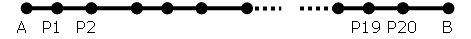
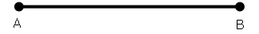
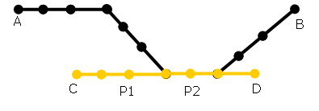
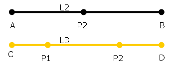
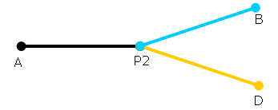

::: {#representación-de-la-red-de-transporte .section .level3}
### Representación de la red de transporte

Una red de transporte se puede modelar con un conjunto relativamente
reducido de elementos. En GoalBus®, los componentes básicos de una red
pueden modelarse con una representación simplificada de las líneas que
incluye sólo los puntos relevantes para la planificación, o bien incluir
una representación detallada con todas las paradas intermedias.

Ejemplo 1

Si se quiere modelar una línea que tiene 20 paradas y dos cabeceras de
línea, pero en ninguna de las paradas intermedias (es decir, que no son
cabeceras) no se tiene otra opción más que recoger o dejar viajeros,
para GoalBus® ninguna de esas paradas tiene valor para calcular una
solución y, por tanto, no se tomarán en cuenta en el modelo.

[]{#_Toc333431367 .anchor}

[]{#_Toc465674429 .anchor}2 Paradas reales

[]{#_Toc333431368 .anchor}

[]{#_Toc465674430 .anchor}3 Paradas en GoalBus®

Por tanto, las Paradas en GoalBus® representan paradas físicas
relevantes para la red y su organización interna, como sería el caso de
una parada en la que se puede cambiar de línea o hacer un cambio de
conductor.

Siempre es necesario definir las Paradas que representan las cabeceras
de cada línea, dado que es la composición mínima de una línea.

Las cocheras (o depósitos), si no son paradas de una línea, deben
incluirse en el modelo como Parada.

Ejemplo 2

Sea una red con dos líneas L2 y L3 que tienen tres paradas reales
comunes. De las tres, sólo en una (P2) se puede efectuar un relevo de
conductor y además, para una de las líneas, hay una parada no común (P1)
en la cual se puede efectuar un relevo y hacer paradas de descanso para
los conductores.

[]{#_Toc333431369 .anchor}

[]{#_Toc465674431 .anchor}4 Paradas reales de las líneas L2 y L3.

[]{#_Toc333431370 .anchor}

[]{#_Toc465674432 .anchor}5 Paradas en GoalBus® de las líneas L2 y L3.

Una red con líneas que comparten paradas se podría modelar de muchas
maneras distintas dependiendo de la casuística del escenario. Por eso en
GoalBus® los elementos estructurales más importantes no son las líneas,
sino los recorridos entre dos paradas; estos elementos mínimos
necesarios para construir una línea se denominan Arcos.

Un Arco define una relación entre dos paradas. Un Arco posee un sentido,
es decir, existe una parada origen y una parada destino. Un autobús sólo
puede recorrer un camino con viajeros si este está definido mediante un
Arco. Cuando se define un Arco entre dos paradas se está informando de
la existencia de un recorrido entre ambas paradas.

Ejemplo 3

Partiendo del ejemplo anterior con la línea L2, sería necesario definir
los arcos siguientes: A→P2, P2→B, B→P2 y P2→A. Los arcos en ambos
sentidos permitirán luego definir ambos sentidos de la línea. Para la
línea L3 sería necesario definir los arcos siguientes: C→P1, P1→P2,
P2→D, D→P2, P2→P1 y P1→C.

No es necesario definir un Arco entre cocheras y las cabeceras de las
líneas porque los viajes entre cocheras y cabeceras se realizan sin
viajeros.

En GoalBus®, una Línea es una agrupación de uno o más Trayectos. Un
Trayecto es un itinerario de ida y vuelta entre dos paradas llamadas
cabecera y terminal. Las condiciones para crear un Trayecto son mínimas;
primero, siempre debe pertenecer a una Línea, y segundo, posee dos
sentidos, el de ida (sentido 1) y el de vuelta (sentido 2). Además, cada
uno de los sentidos se define mediante una secuencia de arcos de manera
que el destino de un arco debe ser el origen del siguiente.

Ejemplo 4

La definición de un Trayecto como un conjunto ordenado de Arcos es muy
flexible y permite al usuario un amplio abanico de posibilidades
contando con un número relativamente pequeño de arcos. Por ejemplo, una
línea en Y puede modelarse con los arcos A→P2, P2→B, B→P2, P2→A, P2→D,
D→P2 y con dos trayectos.

[]{#_Toc333431371 .anchor}

[]{#_Toc465674433 .anchor}6 Definición de trayectos

Trayecto 1: (Sentido 1) A→P2, P2→B y (Sentido 2) B→P2, P2→A

Trayecto 2: (Sentido 1) A→P2, P2→D y (Sentido 2) D→P2, P2→A

Por último, existen todavía dos elementos imprescindibles básicos para
componer un escenario: los servicios de conductor y los autobuses. Sobre
ambos se podrán definir una serie de restricciones que acotan su margen
de actuación según las necesidades del usuario de GoalBus®.
:::
