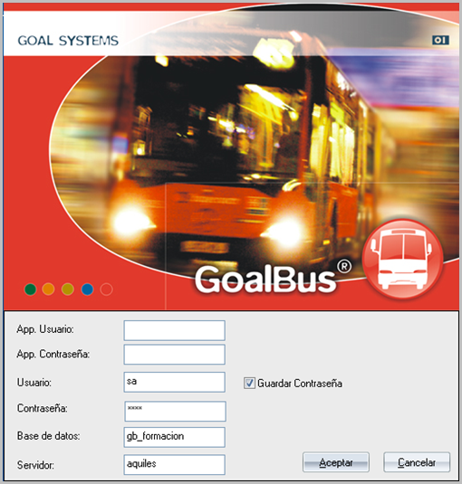
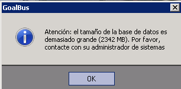
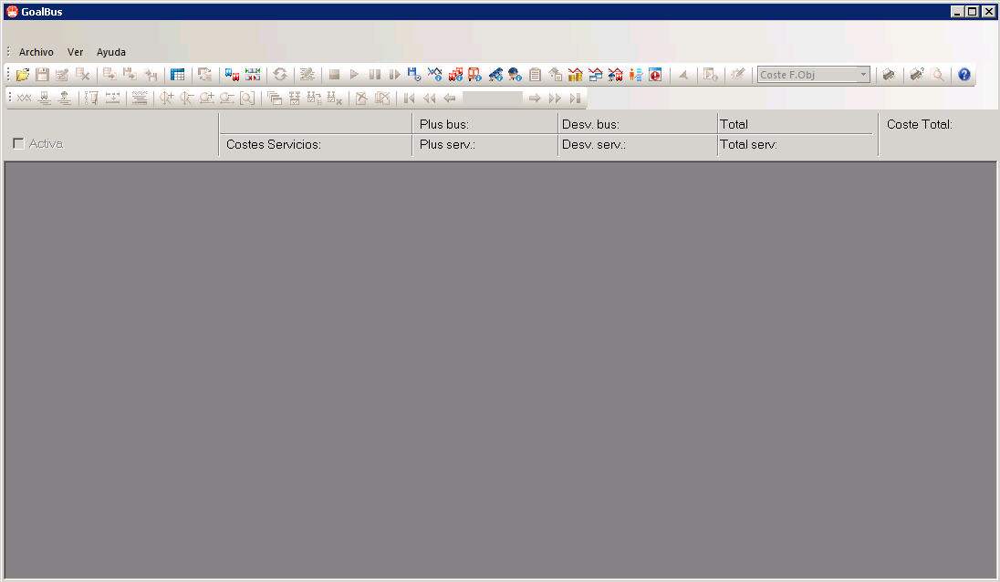

::: {#gestión-de-usuarios-y-arranque-de-goalbus .section .level2}
Gestión de usuarios y arranque de GoalBus®
------------------------------------------

La herramienta GoalBus® dispone de un control de usuarios. Dentro de una
empresa donde esté implantada la aplicación pueden existir distintos
perfiles potenciales de usuarios. Por este motivo, es posible definir
los perfiles y a qué tienen acceso dentro de la herramienta de cada uno
de ellos. Normalmente va a existir un usuario que controla todo el
proceso de creación de soluciones desde su inicio hasta su puesta en
producción. Existe otro perfil de usuario denominado usuario operativo
cuya función va a ser el trabajo con soluciones y gráficos. Toda la
información referente a usuarios está contenida en un documento
específico llamado "Manual Usuario Users Module".

GoalBus® debe estar instalado en la carpeta
**C:\\GoalSystemsGoalBus\\GoalBus\\** del disco duro de la máquina
cliente. Todos los archivos necesarios para el funcionamiento de
GoalBus® se encuentran dentro de esa carpeta y no deben ser modificados
por el usuario.

Para acceder a GoalBus®, el usuario dispone de un
acceso directo en el escritorio. Haciendo doble clic sobre ese icono, se
ejecuta GoalBus® y se inicia la conexión con la base de datos de la
parte Servidor de la aplicación. Para realizar dicha conexión aparece
una ventana de seguridad que permite el acceso a la base de datos y que
ofrece la posibilidad de elegir la base de datos a la cual se desea
conectar y el nombre del usuario que se desea utilizar, en el caso en
que haya varios.

Es necesario incluir los datos correctos para poder tener acceso a la
base de datos: nombre de usuario, clave de acceso y nombre del servidor.
Si se trata de un entorno Microsoft SQL Server se añadirá el nombre de
la base de datos.

La ventana de conexión, tanto de Oracle como de SQL Server, guarda los
últimos datos que han sido introducidos y los muestra por defecto.

A continuación, se muestra el aspecto de la ventana de conexión:

[]{#_Toc465674434 .anchor}7 Ventana de conexión

Tras introducir correctamente las credenciales y los datos de conexión,
en caso que el tamaño de la base de datos a la que se conectará supere
los 2GB se mostrará un mensaje de aviso cuando el usuario intente
acceder a la aplicación.

[]{#_Toc465674435 .anchor}8 Mensaje de aviso tamaño de base de datos

Este mensaje informa el usuario que el tamaño de su base de datos es
demasiado grande y que el rendimiento de la aplicación puede verse
afectado por esta razón, así como los procesos de transferencias de los
ficheros de backup de base de datos.

Este mensaje es puramente informativo, y no impide la ejecución de la
aplicación, es decir, una vez pulsado en ok sobre la ventana, se podrá
continuar con la ejecución normal de la aplicación.

Una vez establecida la conexión, se abre GoalBus® mostrándose la ventana
de inicio por defecto, cuya apariencia se ve en la siguiente
ilustración:

[]{#_Toc465674436 .anchor}9 Ventana de inicio de GoalBus®

[[[]{#_Toc461720053 .anchor}]{#_Toc461634741 .anchor}]{#_Toc461621289
.anchor}
:::
