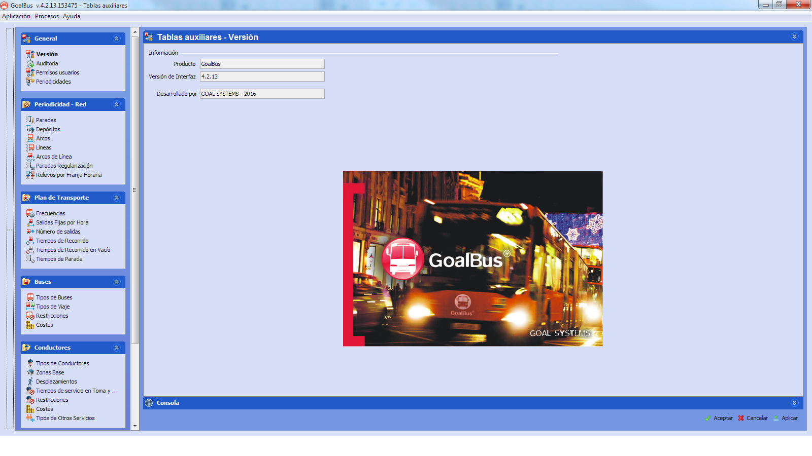

::: {#tablas-auxiliares .section .level2}
Tablas auxiliares
-----------------

Las tablas auxiliares contienen los datos estructurales que resultan
comunes a todos los escenarios y que actúan como catálogo para la
creación de modelos, evitándose de esta manera tener que introducir
información repetida en escenarios distintos. Es decir, la información
que es común a todos los escenarios se introduce en las tablas
auxiliares, de forma que al configurar un escenario simplemente habrá
que elegir qué datos de entre los que ya se han introducido en las
tablas auxiliares se quieren utilizar.

Al hacer clic en el botón Tablas auxiliares
 de la barra de
herramientas (o al utilizar la barra de menús: Archivo Tablas
Auxiliares) aparece una ventana dividida en dos partes.

La parte izquierda dispone de un árbol de navegación con distintas
carpetas, una para cada uno de los elementos estructurales que son
comunes a todos los escenarios y que a continuación se describen.

La parte derecha se actualiza al seleccionar una sección en el árbol de
navegación, para mostrar la ventana de configuración que contiene los
parámetros que definen el elemento seleccionado.

[]{#_Toc465674439 .anchor}12 Ventana principal de las Tablas auxiliares

-   General: Carpeta donde se guardan guardan los datos básicos sobre
    > las condiciones generales de la empresa en distintos periodos de
    > operación (periodicidades).

-   Red: En esta carpeta se permite la edición de elementos propios de
    > la red, agrupados en cada uno de los periodos en los que cambian
    > las condiciones de operación.

-   Plan de transporte: En esta carpeta se permite la edición de
    > elementos asociados a la oferta comercial. Incluye la información
    > referente a los tiempos de recorrido, movimientos en vacío y
    > oferta de autobuses en cada parada y franja horaria, dentro de un
    > periodo de validez.

-   Buses: Esta carpeta almacena toda la información relativa a los
    > tipos de recursos materiales disponibles, sus restricciones y
    > costes.

-   Conductores: En esta carpeta se recogen los datos relativos a
    > restricciones y costes de recursos humanos.

-   Optimización: Funcionalidad para configurar diferentes métodos de
    > optimización, controlando el algoritmo de búsqueda de soluciones.

-   Índices de cumplimiento: Indicadores para medir la calidad del
    > servicio en cada franja horaria. Miden la regularidad en la
    > frecuencia establecida y el número de pasajeros transportados por
    > hora.

Cada una de estas carpetas requiere la entrada de datos por parte del
usuario, almacenando la información recogida en la base de datos. Este
proceso de recogida de datos se realiza a través de una interfaz de
pantalla específica para cada carpeta, situada en la parte derecha de la
ventana.
:::
