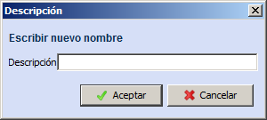

::: {#crear-carpeta .section .level4}
#### Crear carpeta

Para crear una nueva carpeta, donde guardar de forma organizada los
distintos escenarios, seleccionar la carpeta raíz donde se quiere crear
la carpeta, por ejemplo, la carpeta GoalBus en la anterior imagen, y
hacer clic en el botón Crear carpeta . Otra
opción para crear una nueva carpeta es seleccionar la carpeta raíz donde
se quiere crear y hacer clic con el botón secundario del ratón sobre esa
carpeta. Seleccionar entonces la opción Crear carpeta.

Una vez creada la nueva carpeta, hacer clic con el botón secundario del
ratón sobre la nueva carpeta y seleccionar la opción Renombrar carpeta
 en el menú contextual. A continuación, indicar
el nombre de la nueva carpeta y Aceptar para completar el proceso de
creación de la nueva carpeta.

:::
