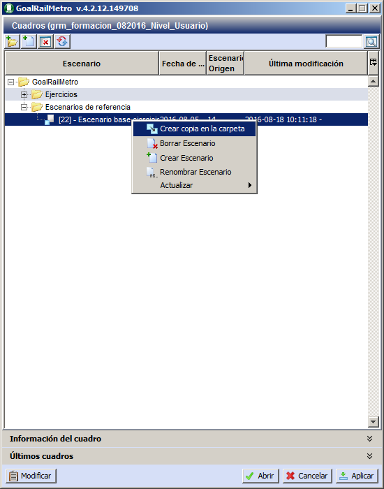
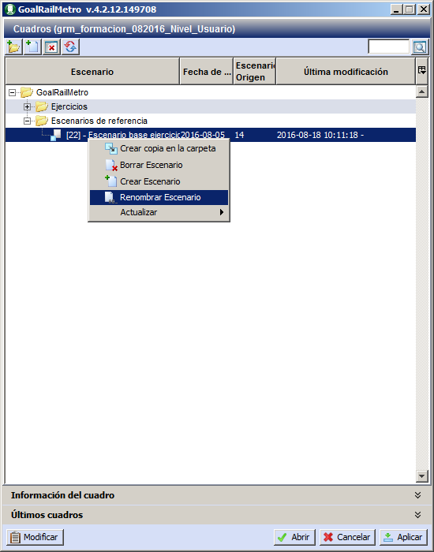

::: {#copiar-escenario .section .level4}
#### Copiar escenario

Para realizar una copia de un escenario, seleccionar el escenario que se
desea copia y hacer clic con el botón secundario del ratón sobre dicho
escenario. En el menú contextual que aparece, seleccionar la opción
Crear copia en la carpeta. 

[[]{#_Toc465674442 .anchor}]{#_Toc461035611 .anchor}15. Crear copia de
escenario en la misma carpeta

La copia del cuadro seleccionado se creará automáticamente en la misma
carpeta. Para trasladar el nuevo escenario a la carpeta deseada,
seleccionar con el ratón el escenario y arrastrarlo hasta la carpeta
deseada.

En cualquier momento, se puede cambiar el nombre de los cuadros. Para
ello, seleccionar el cuadro y hacer clic con el botón secundario del
ratón para abrir el menú contextual. Seleccionar la opción Renombrar
escenario .

[[]{#_Toc465674443 .anchor}]{#_Toc461035612 .anchor}16. Renombrar
Escenario
:::
