::: {#menú-contextual .section .level4}
#### Menú contextual

El menú contextual que se abre al hacer clic con el botón derecho sobre
un escenario dispone de varias opciones que se detallan a continuación:

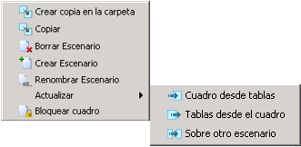

[]{#_Toc465674444 .anchor}17 Menú Contextual

::: {#copiar-pegar-escenario .section .level5}
##### Copiar / Pegar escenario

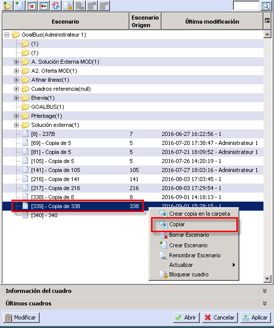

[]{#_Toc465674445 .anchor}18 Copiar un Escenario

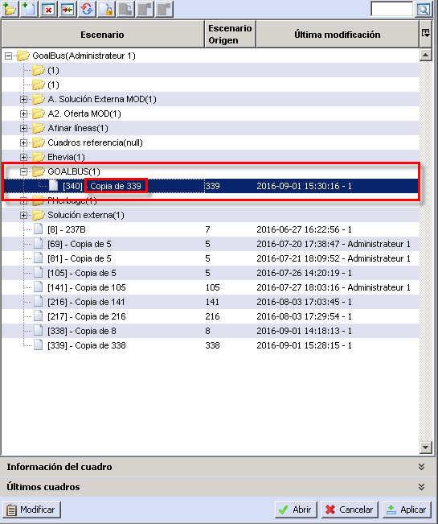

[]{#_Toc465674446 .anchor}19 Pegar Escenario en la carpeta de destino
:::

::: {#borrar .section .level5}
##### Borrar

Se elimina el Escenario seleccionado, y no es posible recuperarlo.

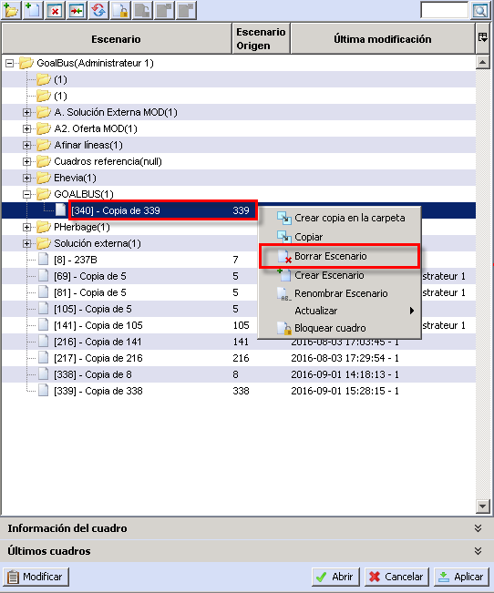

[]{#_Toc465674447 .anchor}20 Borrar Escenario

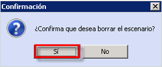

[]{#_Toc465674448 .anchor}21 Cuadro de confirmación

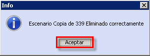

[]{#_Toc465674449 .anchor}22 Cuadro de información
:::

::: {#crear-escenario .section .level5}
##### Crear Escenario

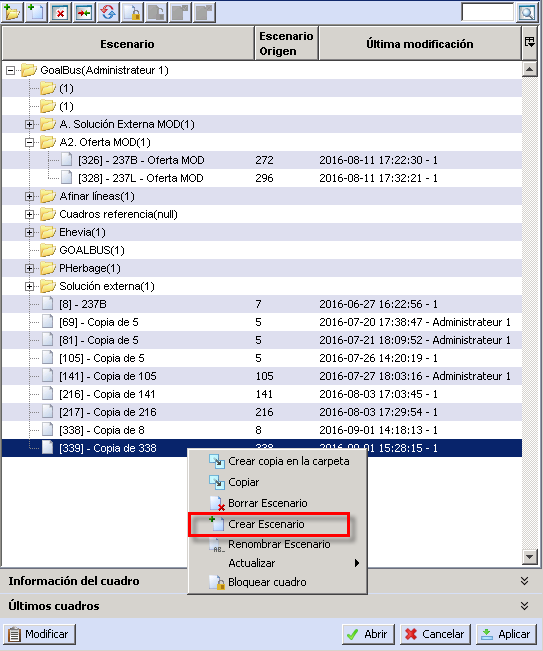

[]{#_Toc465674450 .anchor}23 Crear Escenario

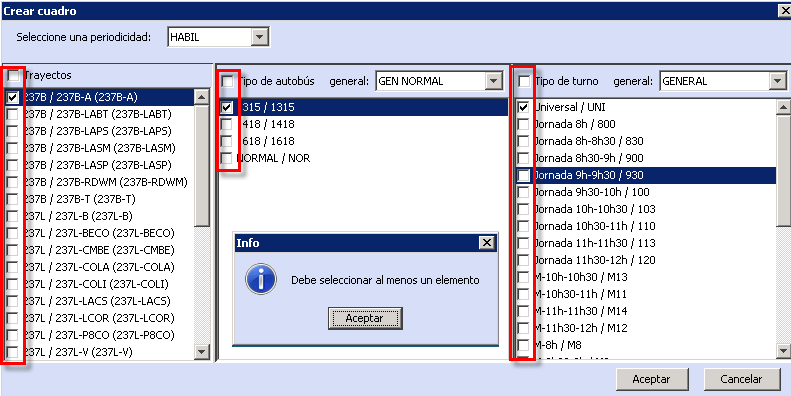

[]{#_Toc465674451 .anchor}24 Gestor de Crear Escenario

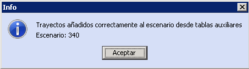

[]{#_Toc465674452 .anchor}25 Cuadro de Información
:::

::: {#renombrar-escenario .section .level5}
##### Renombrar Escenario

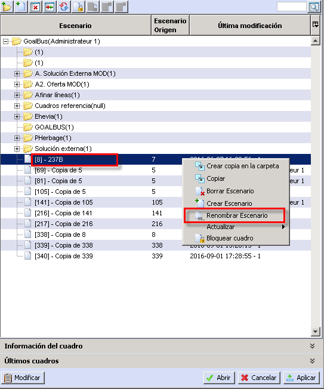

[]{#_Toc465674453 .anchor}26 Renombrar Escenario

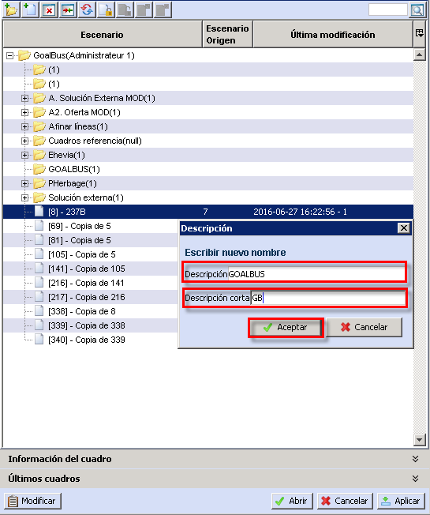

[]{#_Toc465674454 .anchor}27 Renombrando Cuadro

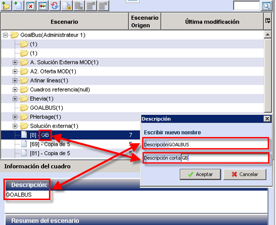

[]{#_Toc465674455 .anchor}28 Cuadro Renombrado
:::

::: {#actualizar-cuadros .section .level5}
##### Actualizar cuadros

Las opciones permiten actualizar la información de un escenario desde
Tablas auxiliares, actualizar las tablas con la información del cuadro,
o copiar los datos del escenario sobre otro escenario.

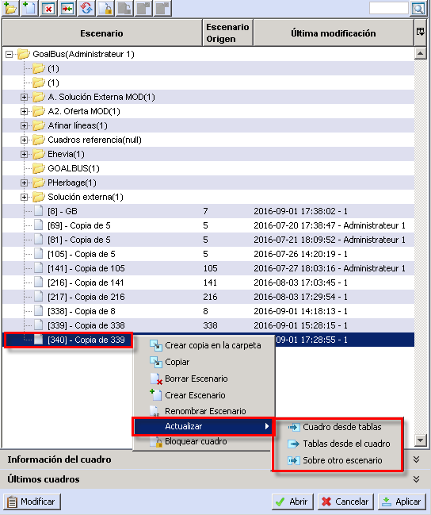

[]{#_Toc465674456 .anchor}29 Actualizar Cuadro

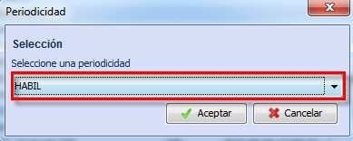

[]{#_Toc465674457 .anchor}30 Actualizar Cuadro desde tablas

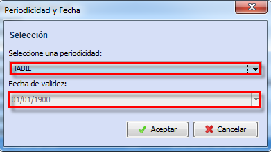

[]{#_Toc465674458 .anchor}31 Actualiza tablas desde el Cuadro

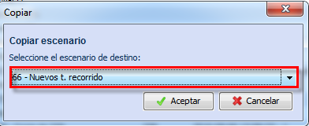

[]{#_Toc465674459 .anchor}32 Actualiza Sobre otro escenario
:::

::: {#bloquear-cuadro .section .level5}
##### Bloquear cuadro

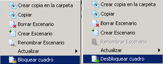

[]{#_Toc465674460 .anchor}33 Bloquear/Desbloquear Cuadro
:::
:::
