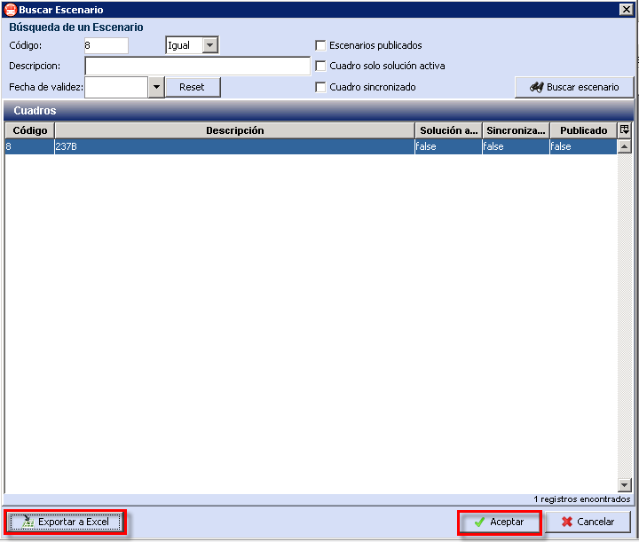

::: {#otras-acciones .section .level4}
#### Otras acciones

A continuación, se explica el resto de opciones que se pueden encontrar
en esta ventana:

-   Eliminar carpeta (): permite eliminar una
    > carpeta creada con anterioridad.

-   Borrar escenario (): elimina el escenario
    > seleccionado.

-   Crear Escenario (): permiten crear un
    > escenario nuevo.

-   Copiar Escenario (): permite crear una copia
    > del escenario seleccionado. Esto permite al usuario realizar
    > diversas simulaciones con configuraciones diferentes, partiendo de
    > un mismo escenario de referencia.

-   Actualizar (): refresca la información sobre
    > los escenarios.

-   Fusión (): Abre una ventana que permite la
    > Fusión de cuadros (ver explicación en el capítulo 4.1.3).

-   Borrado Múltiple (): Permite borrar cuadros
    > de forma masiva seleccionándolos de una ventana.

Esta opción permite al usuario eliminar los cuadros de forma más rápida
y eficaz, pudiendo seleccionar varios cuadros a la vez para ser borrados
al no tener que borrarlos de uno en uno. Es posible borrar todos los
cuadros marcando la opción Marcar todos y a continuación pulsar en
Aceptar, o por el contrario marcar por separado cada casilla de los
cuadros a borrar y a continuación hacer clic en Aceptar.

[]{#_Toc465674461 .anchor}34 Borrado múltiple de escenarios

-   Buscar escenario (): abre la ventana de
    > búsqueda de escenarios que permite búsquedas por código,
    > descripción y fecha de validez.

[]{#_Toc465674462 .anchor}35 Buscar un escenario

-   Búsqueda rápida de escenario: Al seleccionar el campo de texto a la
    > izquierda del icono de búsqueda, es posible buscar mediante su ID
    > el escenario deseado directamente, en la misma ventana de gestión.
    > Después de escribir el número de ID, presione la tecla intro para
    > localizar el escenario.

[]{#_Toc465674463 .anchor}36 Búsqueda rápida de escenarios

-   Exportar Escenario a Excel

[]{#_Toc465674464 .anchor}37 Búsqueda rápida de escenarios y exportar
escenario
:::
