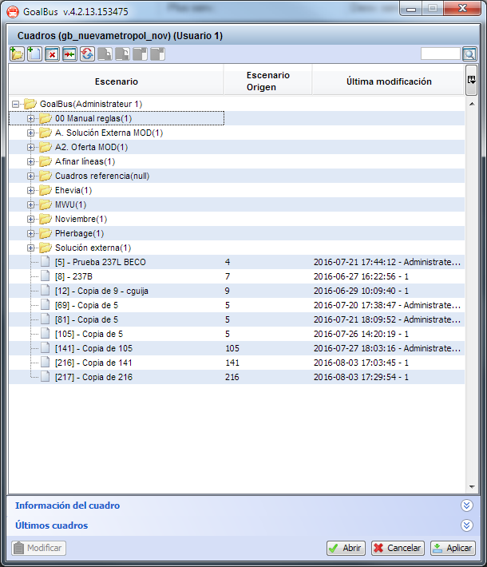

::: {#gestión-de-escenarios .section .level3}
### Gestión de escenarios

Una de las ventajas que tiene la aplicación GoalBus® es que es muy
rápido y sencillo hacer copias de cuadros, lo que facilita hacer
simulaciones y plantear situaciones de tipo *what-if*. La facilidad para
hacer copias o crear nuevos escenarios, organizándolos en carpetas,
ayuda a trabajar con diferentes situaciones y negociar con los
sindicatos si, por ejemplo, viene un nuevo convenio. También permite
valorar nuevas situaciones como la incorporación de más oferta, cambiar
algún aspecto de los turnos de los conductores o valorar el impacto que
puede tener un cambio en la planificación. Todo ello sin la necesidad de
hacer copias de seguridad de la base de datos.

Para acceder al gestor de escenarios, pulsar el botón Abrir
 en la ventana general de cálculo de soluciones.
Se abre entonces la ventana donde se listan los escenarios y las
carpetas que contienen escenarios. Para abrir un escenario, hay que
seleccionarlo en la lista de escenarios y hacer clic en el botón Abrir o
utilizar la opción "Abrir" del menú contextual al que se accede con el
botón derecho del ratón.

[]{#_Toc465674440 .anchor}13 Aperturas de un Escenario en Ventana Gestor
de Cuadro
:::
