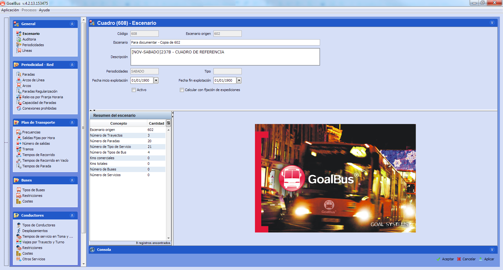

::: {#modificar-un-escenario .section .level3}
### Modificar un escenario

Al hacer clic en el botón Modificar
 aparece la
ventana Modificar datos del escenario, muy similar a la de las tablas
auxiliares, como puede verse en la ilustración:

[]{#_Toc465674465 .anchor}38 Ventana principal de edición de escenarios

**Nota.** Los datos almacenados en la ventana de edición de escenarios
son una copia de los que estaban disponibles en Tablas auxiliares al
crear el cuadro. Se puede modificar los datos del escenario sin alterar
los valores originales que están almacenados en las Tablas auxiliares, y
viceversa.

De este modo, cada cuadro puede almacenar valores para representar un
escenario de planificación diferente, sin afectar al resto de cuadros.
Esto permite realizar simulaciones de condiciones cambiantes en la red
de transporte, o en las reglas de planificación, sin afectar a los datos
reales de la operación.

Al seleccionar la raíz del árbol de carpetas, la parte derecha de la
ventana contiene información sobre el escenario. Si el usuario está
creando un escenario nuevo, algunos campos estarán vacíos.

A continuación, se detallan las informaciones del panel General.

-   Código: Es el código del escenario asignado automáticamente por
    > GoalBus®.

-   Escenario: Nombre del escenario creado por el usuario.

-   Descripción: Comentario sobre el origen y el propósito para el que
    > se ha creado el escenario

-   Fecha de validez / explotación: Fecha de validez y periodo de
    > utilización del escenario indicada por el usuario.

-   Resumen del cuadro: Esta pestaña contiene información sobre el
    > escenario abierto.

-   Activo: Esta casilla permite almacenar la solución obtenida en el
    > escenario. Esto marca las soluciones validadas por el usuario y
    > permite exportarlas como tareas a otros módulos de GOAL SYSTEMS.

-   Calcular con fijación de expediciones: Con la casilla activa, se
    > realiza el cálculo de material con solución fijada.
:::
