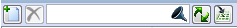

---
---
#### Menu de tablas

En algunas de las tablas que se incluyen en las ventanas de
parametrización se incluye una barra superior que permite, mediante la
interacción con la interfaz, la realización de las siguientes acciones:

-    Insertar registro

-    Eliminar registro

En caso de situarse en un marco donde se pueden introducir registros
nuevos e introducir datos desde el teclado, se deben utilizar los
botones Crear y Borrar del marco correspondiente para crear registros o
borrar los existentes:

Si el marco permite más de un registro, es posible crear y borrar de uno
en uno todos los registros que se desee.

-    

Buscar
    > mediante filtro: El campo de texto junto con el botón Buscar
    > permite realizar una búsqueda por texto en todos los campos de la
    > tabla en la que aparece.

-    Actualizar

-    Exportar a Excel

