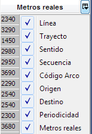

::: {#mostrarocultar-columnas .section .level4}
#### Mostrar/Ocultar columnas

Mediante la opción de Mostrar/Ocultar columnas, disponible en cada una
de las tablas que se muestran en las ventanas de parametrización de
cuadros y tablas auxiliares, se permite la selección de las columnas a
mostrar:

[]{#_Toc465674468 .anchor}41 Mostrar/Ocultar columnas
:::
