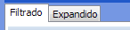
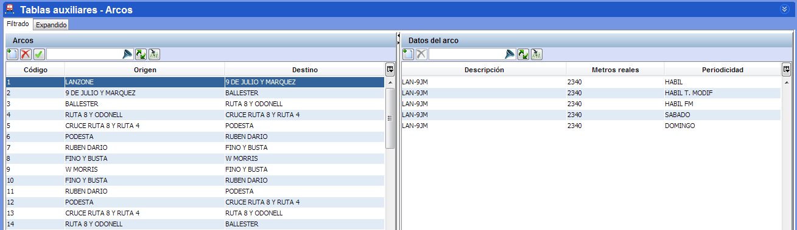
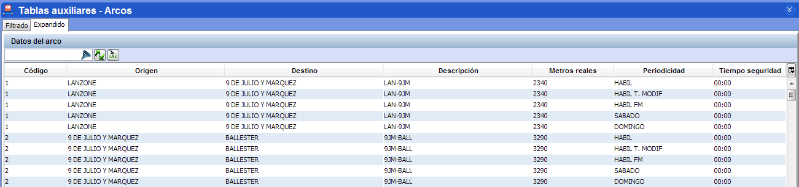

::: {#vista-filtrada-y-vista-extendida .section .level4}
#### Vista filtrada y Vista extendida

En varias de las ventanas de parametrización de cuadros y tablas
auxiliares existe la posibilidad de modificar el modo en el que son
visualizados los datos utilizando para ello las pestañas de vista
filtrada y vista extendida:

[]{#_Toc465674469 .anchor}42 Vista filtrada/extendida

La vista filtrada es la visualización usada por defecto en las ventanas
de parametrización y permite la inserción de datos a través de la
concatenación en la selección de los diferentes parámetros (línea,
sentido, estación, etc.).

Para realizar consultas de los datos parametrizados, el proceso es
idéntico: mediante la concatenación de selecciones en las diferentes
tablas, se termina mostrando la información de la configuración.

[]{#_Toc465674470 .anchor}43 Vista filtrada

En ciertas ocasiones sin embargo, es necesario disponer de un único
vistazo de toda la información parametrizada en la misma ventana. El
modo de visualización extendido permite realizar comparaciones entre los
registros introducidos en las ventanas que disponen de dicha
visualización.

[]{#_Toc465674471 .anchor}44 Vista extendida

**NOTA.** La vista extendida es únicamente un modo de visualización y no
permite la inserción de datos.
:::
