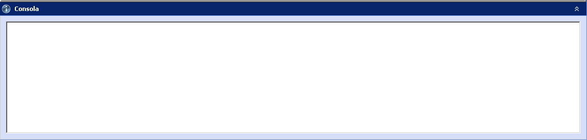

::: {#consola-de-cambios .section .level4}
#### Consola de cambios

En la parte inferior de todas las ventanas es posible desplegar un marco
que muestra información importante sobre el entorno de ejecución. La
pestaña Consola informa de las acciones ejecutadas sobre la base de
datos a través de la interfaz, y la pestaña Versión ofrece datos sobre
la versión de GoalBus® instalada en la máquina cliente. Es aconsejable
consultar los mensajes de la pestaña Consola antes de usar los botones
Aceptar o Cancelar.

[]{#_Toc465674472 .anchor}45 Ventana de información

Por último, es posible variar la apariencia de la ventana replegando o
expandiendo los marcos que la componen, pinchando las flechas situadas
en la cabecera de cada marco:

 
, 
:::
