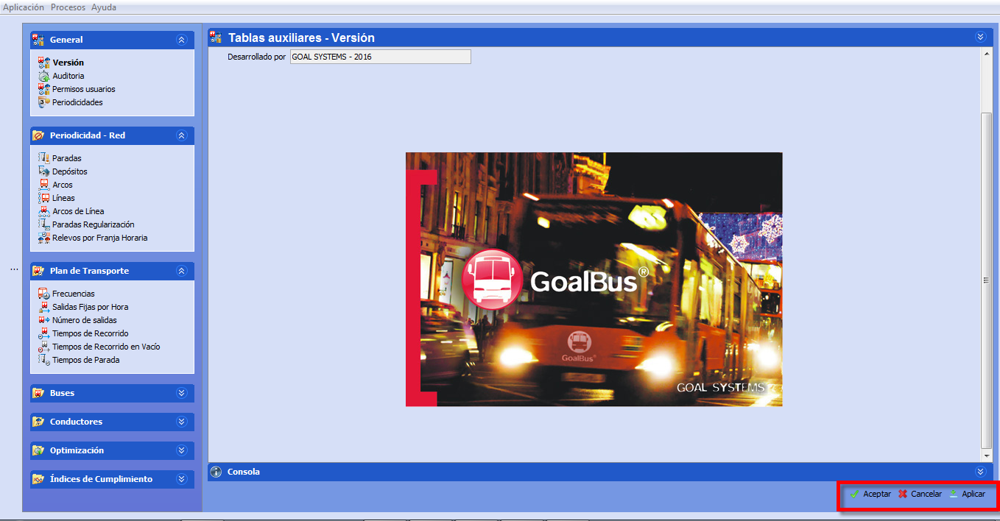

::: {#botones-generales-y-ventana-de-información .section .level3}
### Botones generales y ventana de información

Los botones generales ayudan a gestionar los últimos cambios realizados
sobre los datos de las tablas auxiliares o de un escenario. Estos
botones se encuentran en todas las ventanas en la parte inferior derecha
y se presentan como en la ilustración:

[]{#_Toc465674466 .anchor}39 Botones generales

Una vez guardados los cambios con el botón Aplicar, no es posible
deshacer los mismos. El botón Aceptar guarda las modificaciones y cierra
la ventana, y con el botón Cancelar se sale de la ventana sin guardar
los cambios realizados después del último uso del botón Aplicar.
:::
