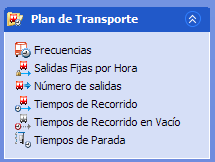

::: {#carpetas-de-agrupación .section .level4}
#### Carpetas de agrupación

En el menú lateral de paneles, es posible ocultar las carpetas
contenedoras de secciones, haciendo clic en el botón:

[]{#_Toc465674473 .anchor}46 Contraer sección

Del mismo modo, es posible volver a mostrar las secciones pulsando el
botón:

[]{#_Toc465674474 .anchor}47 Expandir sección
:::
