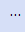
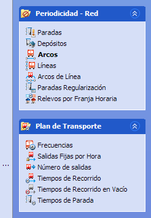
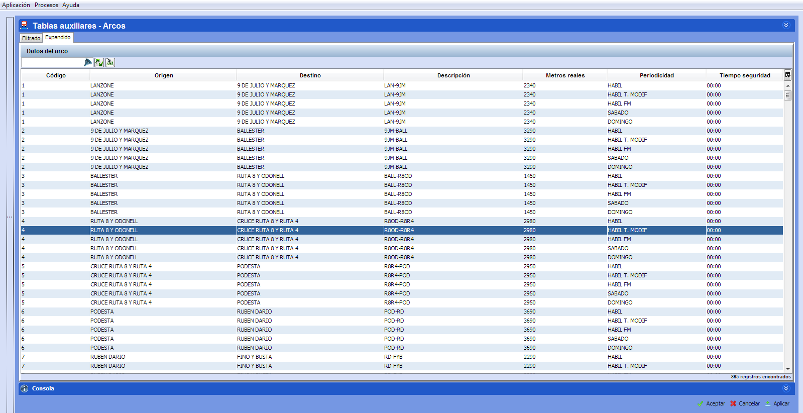

::: {#mostrarocultar-menú-de-navegación .section .level4}
#### Mostrar/ocultar menú de navegación

Del mismo modo, con el objetivo de permitir una mejor visualización de
las ventanas de configuración, es posible ocultar el menú de secciones.

Para ello, es necesario hacer clic en el botón que se encuentra a la
izquierda del menú de secciones:

[]{#_Toc465674475 .anchor}48 Contraer menú lateral

Del mismo modo, haciendo clic sobre el mismo botón, el menú de ventanas
se volverá a mostrar.
:::
