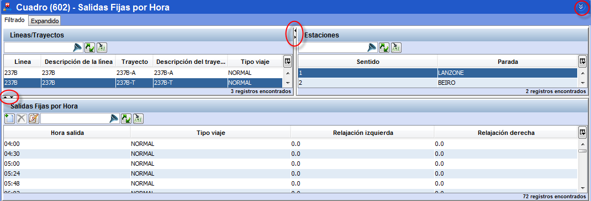

::: {#mostrarocultar-tablas-en-la-ventana .section .level4}
#### Mostrar/ocultar tablas en la ventana

Es posible variar la apariencia de la ventana replegando o expandiendo
los marcos que la componen, pinchando las flechas situadas en la
cabecera de cada marco:

 .

:::
