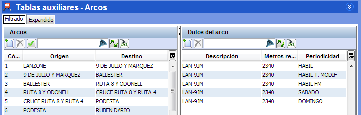
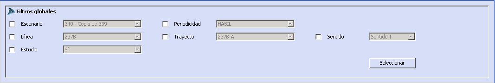

::: {#filtros-globales .section .level3}
### Filtros globales

Para facilitar la localización de los items en las ventanas de
parametrización, se habilitan los filtros globales. Los filtros globales
permiten acceder a la información registrada de una forma más rápida.

A través de la selección de los elementos incluidos en el panel de
Filtros Globales, se permité seleccionar los registros de datos en los
paneles inferiores. Al abrir cada ventana, en las tablas de datos se
seleccionarán automáticamente los registros que corresponden a los
valores grabados en el filtro.

Los filtros globales están accesibles a través del botón que se localiza
en la parte superior de las ventanas de parametrización:

[]{#_Toc465674476 .anchor}49 Mostrar filtros globales

Al pulsar el botón se despliegan los filtros.

[]{#_Toc465674477 .anchor}50 Seleccionar filtros globales

Al pulsar el botón 'Seleccionar', se dará acceso a los registros que
coinciden con los valores de los filtros activos.
:::
