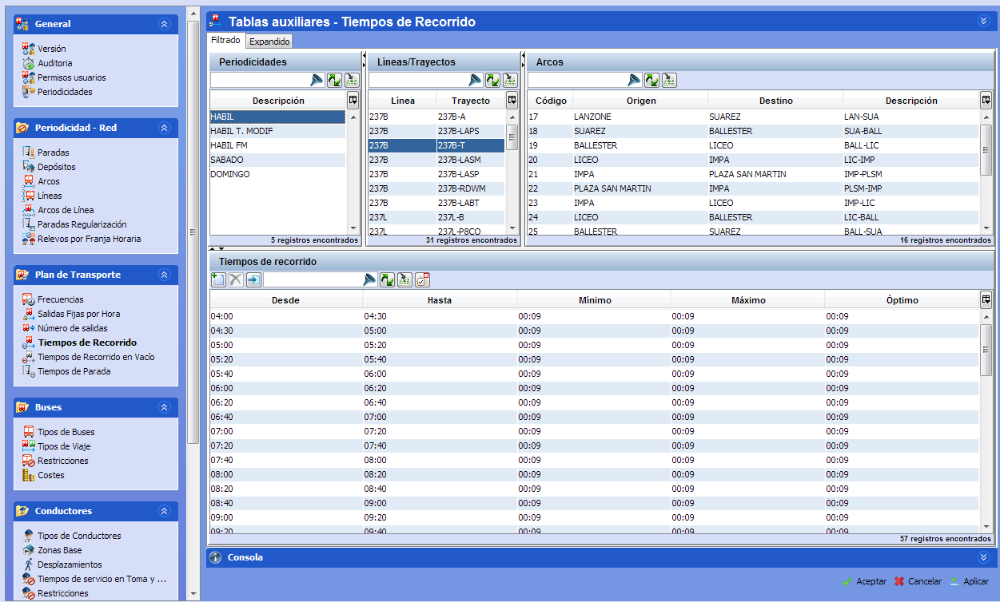

::: {#navegación-general-en-paneles .section .level3}
### Navegación general en paneles

La mayor parte de las ventanas de configuración siguen un patrón de
lógica funcional de izquierda a derecha y de arriba abajo:

[]{#_Toc465674479 .anchor}52 Navegación general en las ventanas de
edición de datos

De izquierda a derecha se seleccionan elementos distintivos partiendo de
elementos generales hasta los específicos. Una vez seleccionados los
elementos, en la parte inferior se realizan en general las
modificaciones o inserciones oportunas para la selección realizada.
:::
