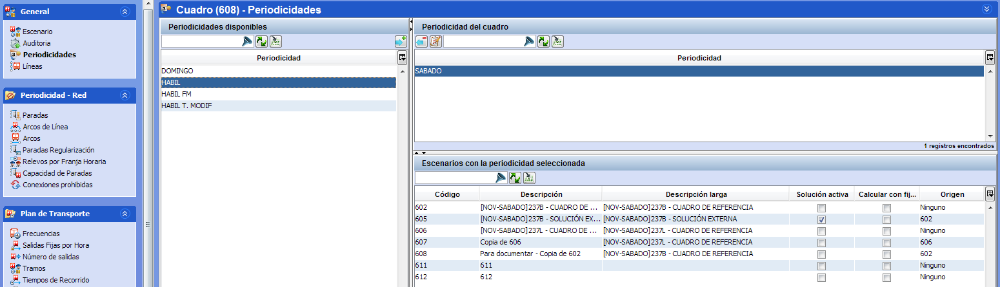

::: {#en-escenarios .section .level4}
#### En escenarios

En la ventana de periodicidades de un escenario se pueden añadir
periodicidades de las tablas auxiliares al escenario:

1.  Seleccionar la periodicidad deseada en la tabla Periodicidades
    disponibles.

<!-- -->

1.  Hacer clic en el botón Añadir. 

[]{#_Toc465674481 .anchor}54 Seleccionar periodicidad de un escenario
:::
