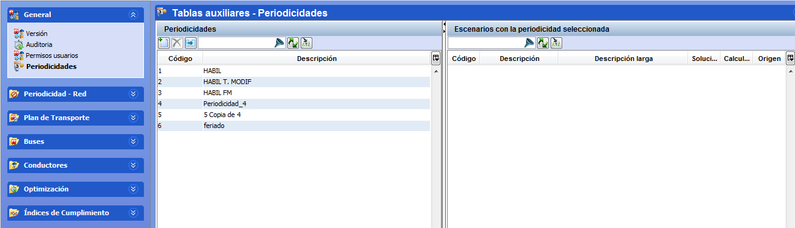

::: {#periodicidades .section .level3}
### Periodicidades

Este concepto va estrechamente unido al concepto de validez de un
escenario. Cada periodicidad se utiliza para almacenar una configuración
específica de parametrización y restricciones, asociadas a un día o
conjunto de días con la misma oferta comercial. Por ejemplo, se pueden
establecer periodicidades para días laborables, fines de semana,
periodos de vacaciones o festivos...

En efecto, la periodicidad permite afinar el periodo de validez de un
escenario ya que una periodicidad divide la validez del escenario en
intervalos (periodos de tiempo) y en ella sólo intervienen algunos (o
todos) los días de la semana aplicables en ese periodo de tiempo.

[]{#_Toc465674480 .anchor}53 Crear periodicidades en tablas auxiliares

En el marco Periodicidades, el usuario puede crear tantas periodicidades
como estime necesario mediante un sencillo proceso:

1.  Hacer clic en el botón Crear.

2.  Introducir la descripción de la periodicidad creada.
:::
