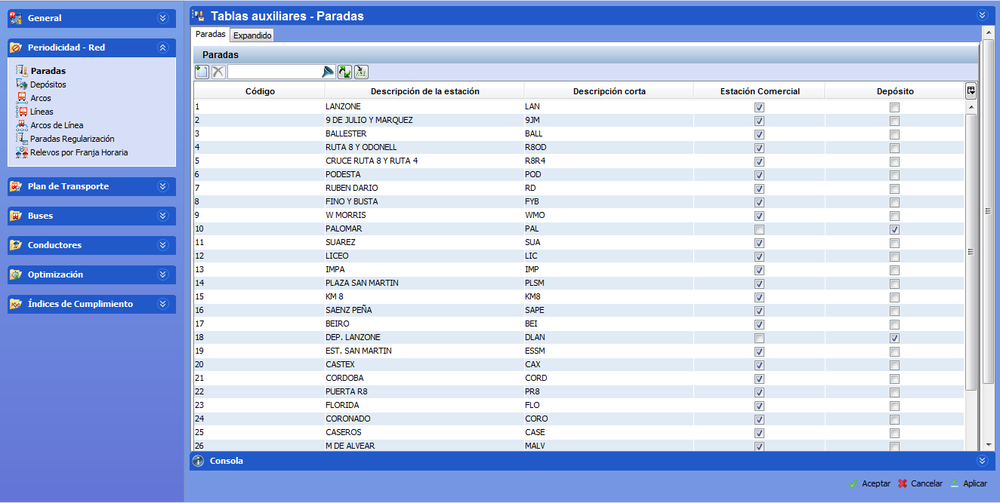

::: {#paradas .section .level3}
### Paradas

Una Parada representa el lugar físico relevante para el problema, bien
por ser cabecera o terminal de línea, por utilizarse para regulación,
descansos, cambios de servicios de conductor, cochera o depósito externo
de autobuses, o cualquier otra circunstancia de interés para el problema
que se pretende resolver.

Las paradas se caracterizan, entre otras, por su capacidad a albergar
autobuses y servicios entrantes y salientes.

Una parada tiene capacidad para albergar "Autobuses salientes" si está
marcada como depósito. En este caso, se puede disponer de un determinado
número de autobuses estacionados en esta parada para su utilización en
algún servicio. De la misma manera, una parada tiene capacidad de
"Autobuses entrantes" si un autobús puede terminar su servicio y ser
estacionado definitivamente en esa parada hasta el final de la jornada.

Una parada tiene capacidad para albergar "Servicios salientes" si en la
parada existe un determinado número de servicios de conductor preparados
y dispuestos para prestar servicio. Igualmente, una parada tiene
capacidad de "Servicios entrantes" si un servicio de conductor puede
terminar su jornada laboral en la parada.

[]{#_Toc465674482 .anchor}55 Paradas

Para crear una parada nueva, en el marco Paradas:

1.  Hacer clic sobre el botón Crear.

2.  Rellenar los campos de descripción de la parada. El campo
    Descripción de la parada contiene el nombre de la parada. El campo
    Descripción corta es el identificador de la parada y contiene un
    máximo de cuatro caracteres. El campo Código es asignado
    automáticamente por GoalBus®.

Ejemplos

-   Un depósito o cochera donde se estacionan los autobuses a la
    > finalización de su jornada, sería un ejemplo de parada con
    > capacidad de autobuses tanto entrantes como salientes, aunque no
    > se realicen intercambios de pasajeros.

-   Normalmente una parada con capacidad de autobuses entrantes y
    > salientes también debe tener capacidad para servicios entrantes y
    > salientes.

-   Una cabecera o una finalización en un trayecto suelen ser ejemplos
    > de paradas ya que en ellas suele regularse la oferta, realizarse
    > relevos, etc.

-   Una parada intermedia en un trayecto en donde puede producirse un
    > relevo de conductor es un ejemplo de parada con capacidad de
    > servicios entrantes y salientes.
:::
