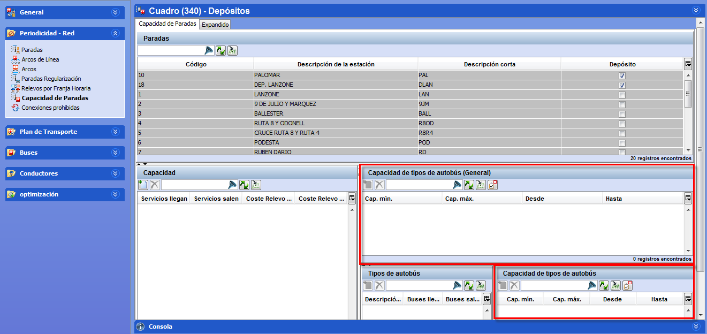

::: {#capacidad-global .section .level4}
#### Capacidad global

La capacidad global permite indicar la capacidad física del depósito,
independientemente de los tipos de autobuses disponibles en la flota. El
parámetro establece el número máximo de huecos que pueden estar ocupados
por vehículos de distintos tamaños.

[]{#_Toc465674484 .anchor}57 Ventana capacidad global

El tamaño en número de huecos que ocupa cada tipo de autobús se
especifica en las especificaciones técnicas de autobús con el parámetro
Ocupación de bus en patios (huecos).
:::
