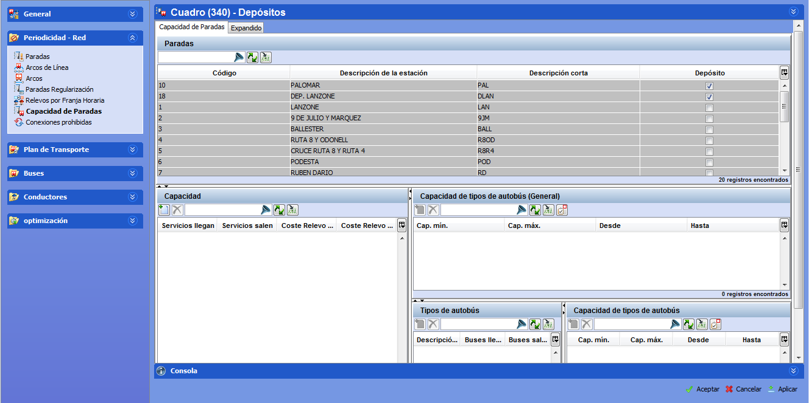

::: {#depósitos-capacidad-de-paradas .section .level3}
### Depósitos / Capacidad de Paradas

En la pestaña Depósitos / Capacidad de Paradas, se pueden marcar los
puntos relevantes de la red que tienen capacidad como depósito de
vehículos. Para cada parada marcada como depósito se define la capacidad
de autobuses y servicios que entran y salen del depósito durante la
jornada de servicio. Además, también es posible introducir la capacidad
por tipo de autobús.

[]{#_Toc465674483 .anchor}56 Capacidad de los depósitos

La pestaña contiene estas tablas:

-   Paradas

-   Capacidad de servicios de conducción

-   Capacidad de tipos de autobús (General)

-   Tipos de autobús

-   Capacidad de tipos de autobús

Al seleccionar un depósito en la tabla Paradas, las otras tablas se
actualizan para mostrar la capacidad de autobuses en ese depósito.

Para introducir el número de buses que llegan y salen, por tipo de
autobús:

1.  Seleccionar la parada en el marco Paradas

<!-- -->

1.  Añadir un tipo de autobús en la tabla Tipos de autobús pulsando
    Crear nuevo registro.

2.  Dar capacidad diaria a la parada rellenando los campos Descripción
    autobús, Buses llegan, Buses salen.

3.  También es posible establecer capacidad por franja horaria en la
    tabla Capacidad de tipos de autobús.

Para introducir los datos de capacidad de servicios de conducción de una
parada en el escenario:

1.  Seleccionar la parada en el marco Paradas.

2.  Dar capacidad de servicios de conducción a la parada rellenando los
    campos Servicios llegan y Servicios salen. Esto indica el número de
    conductores que pueden comenzar o terminar su turno en esta parada.
:::
