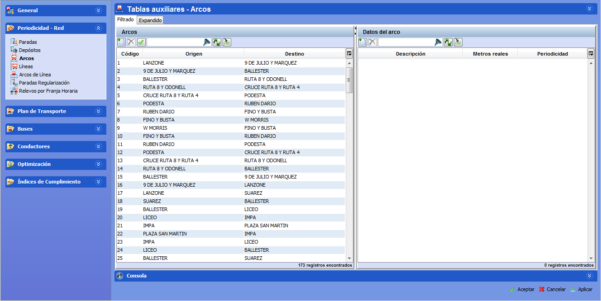

::: {#arcos .section .level3}
### Arcos

Un Arco define una relación entre dos paradas. Un Arco posee un sentido,
es decir, en todo Arco existe una parada origen y una parada destino. Un
autobús sólo puede recorrer un camino con viajeros si está definido
mediante un Arco. Cuando se define un Arco entre dos paradas se está
informando de la existencia de un recorrido entre ambas paradas.

Ejemplos

-   Si un trayecto de Autobús L1 tiene cabecera en A y final en B sin
    > paradas intermedias relevantes, es necesario definir el arco A→B y
    > B→A para luego poder crear el trayecto L1.

-   Si en la línea anterior L1 la cabecera A se alimenta de Autobuses
    > procedentes de la cochera C1, no es necesario definir los arcos
    > C1→A y A→C1.

Es posible definir dos o más arcos A→B si se desean modelar dos o más
trayectos diferentes para ir de A hacia B (cada arco tendrá un código
diferente).

[]{#_Toc465674485 .anchor}58 Arcos

Para crear un arco nuevo:

1.  Hacer clic sobre el botón Crear.

2.  Rellenar los campos Origen y Destino que corresponden a paradas
    previamente definidas. Ambos campos despliegan un buscador
    alfabético automático de arcos al hacer clic sobre el campo. El
    campo Código es asignado automáticamente por GoalBus.

El arco está ahora creado, pero todavía resta por definir su longitud.
Esto se hace en el marco Datos del arco de la siguiente forma:

1.  Hacer clic sobre el botón Crear, para una fecha nueva, o editar la
    fecha seleccionada.

2.  Rellenar los campos Descripción, Fecha de Validez y Metros reales.
    El campo Descripción es la descripción del arco para en caso de
    tener arcos con la misma parada origen y misma parada destino, pero
    incluidos en distintos trayectos poder identificarlos mejor. Fecha
    de Validez es la fecha a partir de la cual los Metros reales del
    arco tienen vigencia para GoalBus®. Para más información, véase el
    apartado 3.4.1 Fechas de validez.

Un arco se elimina seleccionándolo y pinchando en el botón Borrar. Para
guardar los cambios, es necesario pinchar en el botón Aplicar antes de
cambiar de carpeta.
:::
