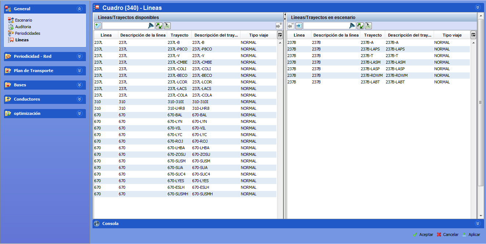

::: {#activar-líneas-en-el-escenario .section .level4}
#### Activar líneas En el escenario

Desde el escenario, en esta ventana se introducen las líneas-trayectos
que van a formar parte del cálculo. Se pueden elegir tantas líneas como
se desee de entre las que se definieron en las tablas auxiliares.

[]{#_Toc333431416 .anchor}

[]{#_Toc465674487 .anchor}60 Selección de líneas en un escenario

Para añadir una o más líneas-trayectos, en el marco Líneas/Trayectos
disponibles:

-   Activar las casillas Añadir de las líneas-trayectos deseadas

-   Pinchar en el botón Añadir al escenario

-   Seleccionar la periodicidad deseada en la ventana emergente que
    > aparece y pulsar aceptar

[[[[]{#_Toc462142655 .anchor}]{#_Toc462076475 .anchor}]{#_Toc462070272
.anchor}]{#_Toc462059020 .anchor}
:::
