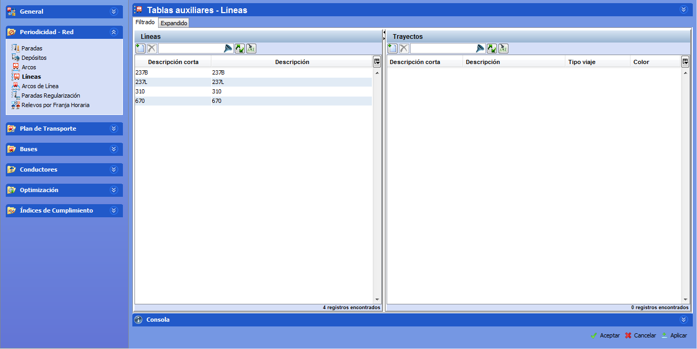

::: {#líneas .section .level3}
### Líneas

Una Línea es una agrupación bajo un mismo nombre de uno o más trayectos.

Ejemplo

Consideremos una línea en Y:

Línea de ejemplo

Para modelarla, se puede definir una sola línea con dos trayectos:

-   **TRAYECTO T1**: A→P2→B (sentido 1) / C→P2→A (sentido 2)

-   **TRAYECTO T2**: A→P2→D (sentido 1) / D→P2→A (sentido 2)

[]{#_Toc465674486 .anchor}59 Definición de líneas en Tablas auxiliares

Para crear una línea nueva, en el marco Líneas:

1.  Hacer clic sobre el botón Crear.

<!-- -->

1.  Rellenar el campo Descripción y modificar el campo Línea del nuevo
    registro creado. Este último campo está limitado a cuatro caracteres
    y será usado en las ventanas de visualización de la solución
    (sección 4.3 Visualización de soluciones) y en las ventanas de
    información (sección 4.4 Ventanas de información), por eso su valor
    debe ser explícito y que permita identificar la línea fácilmente.

La línea estaría creada, pero todavía quedan por definir los trayectos
que la componen. El proceso de crear un trayecto en una línea nueva es
idéntico al de añadir un trayecto a una línea que ya existe:

1.  Seleccionar la línea deseada.

2.  Hacer clic sobre el botón Crear que se encuentra en el marco
    Trayectos.

El campo Trayecto por defecto se rellena con el número de línea al que
pertenece el trayecto más un número según los trayectos que se van
creando, este valor puede ser modificado por el usuario. Este campo está
limitado a seis caracteres y será usado en las ventanas de visualización
de la solución y en las ventanas de información, por eso su valor debe
ser descriptivo y que permita identificar el trayecto fácilmente. Luego
se debe rellenar el campo Descripción donde se permite un nombre más
largo para identificar el trayecto en las tablas de datos.

Una línea o un trayecto se eliminan seleccionándolo y pinchando en el
botón Borrar de la ventana correspondiente. Para guardar los cambios, es
necesario pinchar en el botón Aplicar antes de cambiar de carpeta.

**Nota.** En esta carpeta no se define la estructura interna de la
línea; sólo el nombre comercial de la línea y de los trayectos que la
componen. La estructura interna de los trayectos que componen una línea
se define en la carpeta Arcos de Línea.
:::
