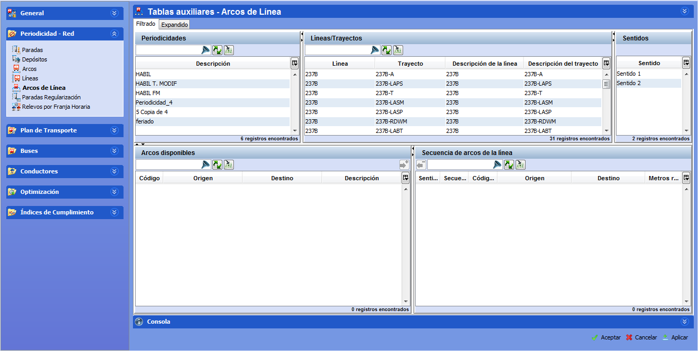

::: {#arcos-de-líneas .section .level3}
### Arcos de líneas

En esta carpeta se introducen los datos relativos a los arcos que
componen los trayectos de cada una de las líneas de su red. Un trayecto
es un itinerario de ida y vuelta entre dos paradas llamadas cabecera y
destino. Un trayecto siempre pertenece a una línea y posee dos sentidos.

Para definir un arco de línea, es necesario que todos los elementos que
lo constituyen, a saber Paradas, Arcos y Líneas, hayan sido introducidos
previamente.

[]{#_Toc465674488 .anchor}61 Arcos de líneas

Para definir los arcos de línea de un trayecto:

1.  Seleccionar la fecha de validez en la que la composición de arcos
    del trayecto tiene vigencia para GoalBus®. Se puede crear una fecha
    de validez nueva haciendo clic sobre el botón Crear.

<!-- -->

1.  Seleccionar la línea-trayecto en el marco Líneas/Trayectos.

2.  Seleccionar el sentido en la pestaña Sentidos.

3.  Añadir de forma secuencial los arcos que componen el trayecto
    seleccionando el arco en el marco Arcos disponibles y haciendo clic
    en Añadir arco a la secuencia.

En el marco Secuencia de arcos de línea aparecerá la configuración final
de un trayecto para cada sentido.
:::
