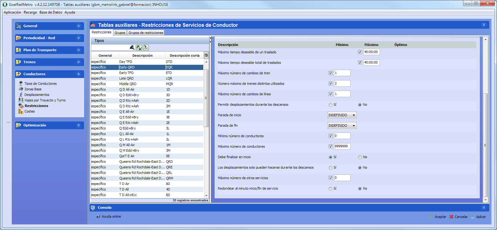

::: {#zona-base-asociada-a-un-depósito .section .level4}
#### Zona base asociada a un depósito

El concepto de Zona Base permite asociar paradas seleccionadas por el
usuario para que GoalBus® las tome como un solo punto, de cara al inicio
y fin de los servicios de conducción. Para establecer las paradas que
van a formar parte de la zona base se debe asignar en la tabla "Paradas
regulación" las paradas que se desean que pertenezcan a una zona. Dichas
paradas serán asignadas en el apartado Depósitos, como se puede observar
en la imagen:

[]{#_Toc465674490 .anchor}63 Depósitos

[]{#_Hlk488230687 .anchor}También se implementa el funcionamiento de
todas sus restricciones asociadas: "los servicios deben finalizar en
inicio" y "descansos (primero y segundo) deben ser en zona base".

La restricción "Los servicios deben finalizar en inicio" se encuentran
localizadas dentro de la ventana Restricciones de conductor, al
seleccionar un servicio de tipo General. Al activar esta restricción, se
indica que los conductores deben finalizar sus servicios en alguna de
las paradas de la Zona Base.

64 Ventana de restricciones de servicios

[]{#_Hlk488230760 .anchor}La restricción "Primer/Segundo descanso debe
ser en zona base" están dentro de la pestaña restricciones al
seleccionar un servicio de tipo Específico. Cuando está activada, fuerza
a que un servicio realice su primer o segundo descanso en alguna parada
adscrita a la zona base. Las restricciones se deben seleccionar como se
observa en la imagen siguiente:

[]{#_Toc465674492 .anchor}65 Ventana de restricciones de servicios

Para hacer uso de esta funcionalidad el usuario marcará la opción "Sí",
si desea que su primer o segundo descanso sea en zona base.
:::
