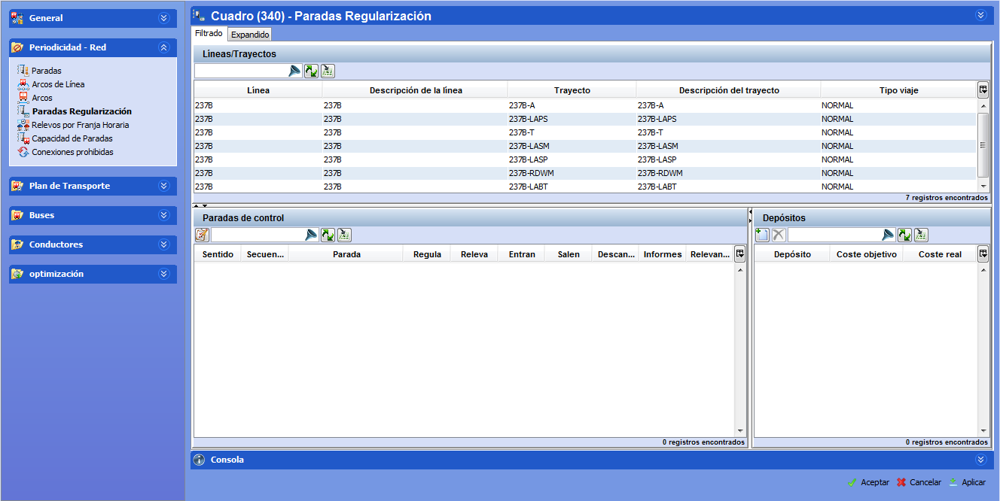

::: {#paradas-de-regularización .section .level3}
### Paradas de regularización

Una vez introducidos los trayectos que van a formar parte del escenario,
es necesario definir qué paradas dentro de los trayectos y dentro de
cada sentido son paradas de regularización. Una parada es de
regularización o regulación si tiene oferta comercial asociada, como por
ejemplo las cabeceras de un trayecto. Cada vez que se añade un trayecto
al escenario se generan automáticamente las posibles paradas de
regularización.

Por cada parada se definirán las siguientes características: si se
adscribe a otra parada (de la que pueda tomar autobuses), si regula (es
decir, si se va a definir una oferta en esa parada en la carpeta
Tiempos), si se permiten relevos, si entran o salen vehículos, si están
permitidos los descansos en dicha parada, y si esa parada aparece o no
en los informes.

[]{#_Toc465674489 .anchor}62 Ventana Regulación de paradas

Para introducir los datos de regularización de las paradas:

1.  Seleccionar la línea-trayecto en el marco línea-trayecto en el marco
    Líneas-Trayectos.

<!-- -->

1.  Seleccionar una parada en el marco Paradas de control e indicar los
    siguientes datos:

-   Regula: Activar esta casilla si esta parada tiene oferta para esta
    > línea-trayecto.

-   Releva: Activar esta casilla si se puede efectuar un relevo de
    > conductor en esta parada.

-   Entran: Activar esta casilla si un autobús puede incorporarse a esta
    > línea-trayecto en esta parada.

-   Salen: Activar esta casilla si un autobús puede dejar esta
    > línea-trayecto en esta parada.

-   Descansa: Activar esta casilla si un conductor puede efectuar un
    > descanso en esta parada.

-   Informes: Activar esta casilla para definir paradas intermedias para
    > los informes.

A la hora de efectuar cálculos en GoalBus®, es conveniente la inclusión
del menor número posible de paradas relevantes (a menor número de
paradas mejores respuesta de cálculo). Sin embargo, existen paradas que,
aunque no son relevantes para el cálculo, sí es relevante su aparición
en los distintos informes. Las paradas con el campo Informes activo son
este tipo de paradas intermedias.

Los campos Sentido, Secuencia y Descripción de la Parada figuran en este
marco como información y no pueden ser modificados por el usuario.

En el marco Paradas Depósito se definen, para cada parada, las paradas
desde las cuales se pueden sacar para abastecer la red tanto conductores
como autobuses. Para cada una hay que definir su coste objetivo y su
coste real. El coste real representa el coste por cada entrada o salida
de un bus en un depósito y el coste objetivo es el que se utiliza para
el cálculo de la función objetivo y son los valores a minimizar.

**Nota.** En esta ventana están a disposición las herramientas de
filtrado y de búsqueda.
:::
