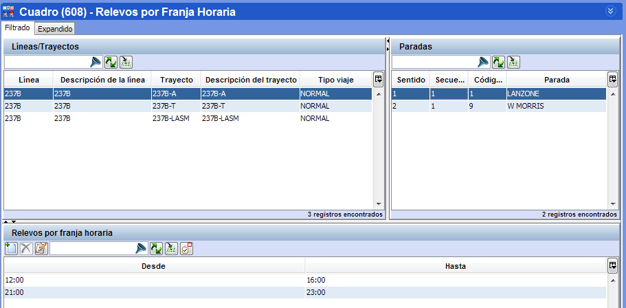

::: {#relevos-por-franja-horaria .section .level3}
### Relevos por franja horaria

En aquellas paradas donde los relevos están permitidos, esta ventana
permite definir las franjas temporales en las que es posible realizar
relevos. Es decir, permite delimitar el periodo de tiempo en el que los
relevos se pueden producir en cada parada.

[]{#_Toc465674493 .anchor}66 Relevos por franja horaria en cada estación

Los paneles superiores permiten elegir el trayecto para el que se
producen los relevos, y la parada para la que se va a añadir una
restricción horaria.

En la tabla del panel inferior se muestran los rangos horarios en los
que es posible realizar un relevo en la parada seleccionada. Si no hay
ningún horario establecido, los relevos se pueden realizar durante todo
el día. Si se crean horarios, los relevos están prohibidos fuera de los
rangos indicados.
:::
