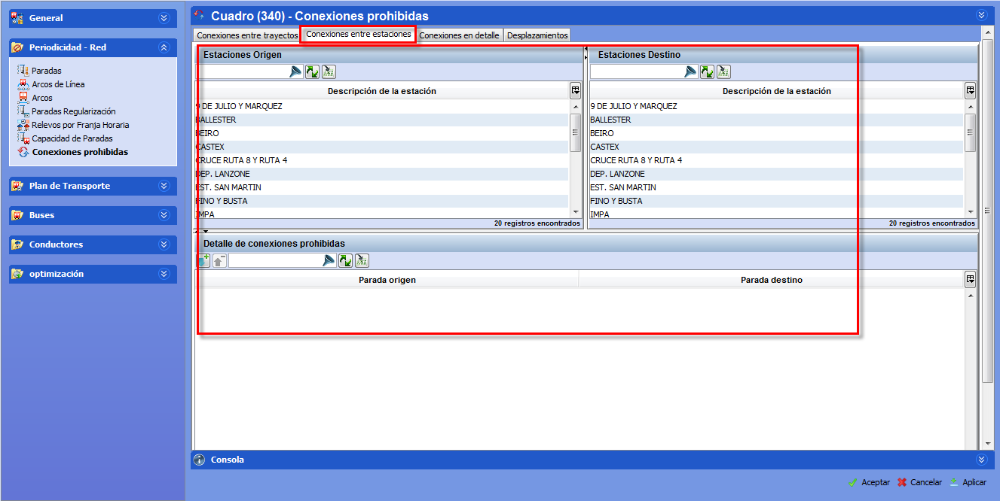

::: {#conexiones-prohibidas-entre-paradas-en-todos-los-trayectos .section .level4}
#### Conexiones prohibidas entre paradas (en todos los trayectos)

Para prohibir la conexión entre dos paradas, en cualquier trayecto que
pasa por la parada:

[]{#_Toc465674495 .anchor}68 Ventana Conexiones (Paradas)

1.  En las pestañas que se encuentran en la parte superior de la
    ventana, seleccionar Conexiones entre paradas.

<!-- -->

1.  En el marco Paradas origen, seleccionar la parada de origen

2.  En el marco Paradas destino, seleccionar la parada de destino

3.  Hacer clic en el botón Añadir, para prohibir la selección
:::
