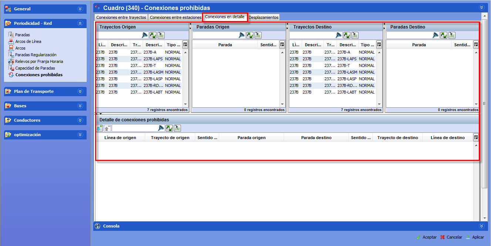

::: {#conexiones-prohibidas-entre-paradas-en-trayectos-concretos .section .level4}
#### Conexiones prohibidas entre paradas (en trayectos concretos)

Para prohibir la conexión entre dos paradas en un punto concreto del
trayecto:

[]{#_Toc465674496 .anchor}69 Ventana Conexiones (detalle)

1.  En las pestañas que se encuentran en la parte superior de la
    ventana, seleccionar Conexiones en detalle

<!-- -->

1.  En el marco Trayectos origen, seleccionar el trayecto de origen

2.  En el marco Paradas origen, seleccionar la parada de origen

3.  En el marco Trayectos destino, seleccionar el trayecto de destino

4.  En el marco Paradas destino, seleccionar la parada de destino

5.  Hacer clic en el botón Añadir, para prohibir la selección
:::
