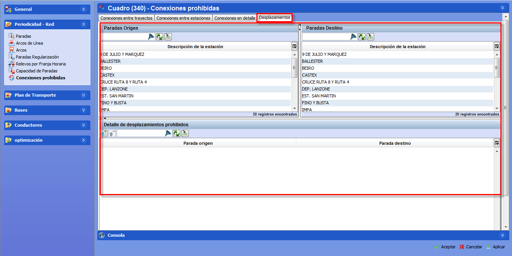

::: {#conexiones-prohibidas-en-desplazamientos-de-conductores .section .level4}
#### Conexiones prohibidas en desplazamientos de conductores

Para prohibir los desplazamientos de conductores por sus propios medios
entre dos puntos de la red:

[]{#_Toc465674497 .anchor}70 Desplazamientos prohibidos

1.  En las pestañas que se encuentran en la parte superior de la
    ventana, seleccionar Desplazamientos

2.  En el marco Paradas origen, seleccionar la parada de origen

3.  En el marco Paradas destino, seleccionar la parada de destino

4.  Hacer clic en el botón Añadir, para prohibir la selección
:::
