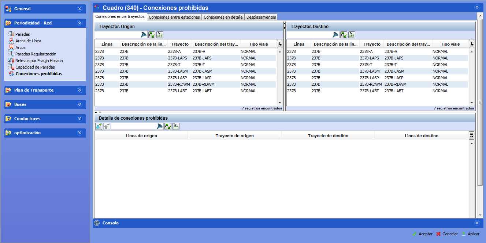

::: {#conexiones-prohibidas .section .level3}
### Conexiones prohibidas

En esta carpeta se introducen las conexiones prohibidas entre paradas,
entre trayectos, entre paradas de dos trayectos con un sentido
determinado, los desplazamientos prohibidos de conductor, y conexiones
prohibidas entre grupos de trayectos. Cada vez que se añade un trayecto
a un escenario se generan automáticamente las posibles conexiones, por
lo que todas las conexiones están permitidas si no se especifica lo
contrario.

Para explicar el concepto de conexiones, se presentan a continuación los
tipos de conexión que pueden prohibirse:

-   Si la conexión entre la parada de origen A y la parada de destino B
    > está prohibida, no podrá haber viajes en vacío que inicien en la
    > parada A y se terminen en la parada B.

-   Si una conexión entre el trayecto de origen T1 y el trayecto de
    > destino T2 está prohibida, no podrá haber viajes en vacío que
    > inicien en una parada del trayecto T1 y se terminen en una parada
    > del trayecto T2.

-   Si una conexión entre la parada A con sentido 1 del trayecto de
    > origen T1 y la parada B con sentido 2 del trayecto de destino T2
    > está prohibida, no podrá haber viajes en vacío que inicien en la
    > parada A inmediatamente después de una expedición realizada en el
    > trayecto T1 con sentido 1 y se terminen en la parada B del
    > trayecto T2 justo antes de iniciar una expedición en el trayecto
    > T2 con sentido 2.

-   Si el desplazamiento andando de un servicio de conductor entre una
    > parada origen A y una parada destino B está prohibido, dicho
    > servicio de conductor no podrá realizar andando ese recorrido.

Se puede prohibir las conexiones entre las paradas A y B y permitir la
conexión contraria, de forma que los autobuses podrían ir de B a A, pero
no de A a B.

El sentido de la parada es importante para las paradas intermedias. Una
cabecera tiene un único sentido y no es necesario especificar el
sentido.

[]{#_Toc465674494 .anchor}67 Ventana Conexiones (Trayectos)
:::
