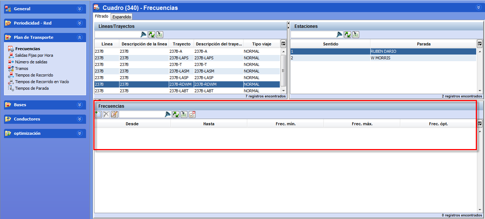

::: {#frecuencias-en-el-escenario .section .level4}
#### Frecuencias en el escenario

Al insertar un trayecto en un escenario, se copiarán en el escenario las
frecuencias definidas en las tablas auxiliares para la periodicidad
seleccionada. Estas frecuencias se podrán modificar para el escenario
sin afectar a los valores guardados en las tablas auxiliares.

Las frecuencias establecidas se aplican en la parada del trayecto
marcada como parada de regularización. Estas frecuencias se podrán
modificar para el escenario sin afectar a los valores guardados en las
tablas auxiliares.

[]{#_Toc465674501 .anchor}74 Modificación de frecuencias en el escenario
:::
