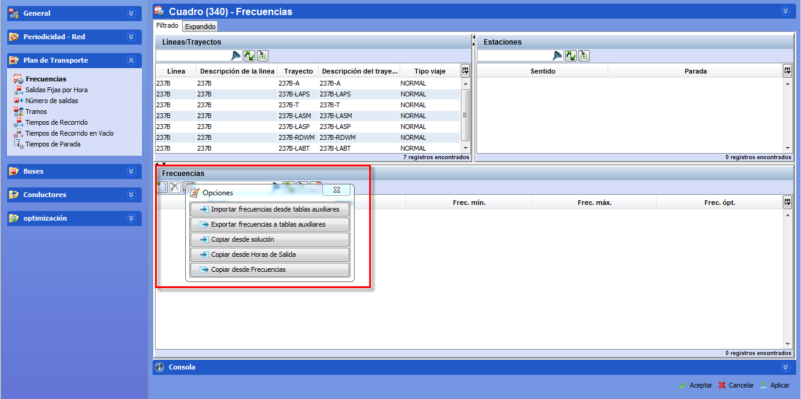

::: {#copiar-oferta-de-un-escenario-a-tablas-auxiliares .section .level4}
#### Copiar oferta de un escenario a tablas auxiliares

En la ventana Frecuencias del escenario, aparece también el panel
Frecuencias donde se pueden copiar las frecuencias desde tablas
auxiliares o desde la solución, así como exportar las frecuencias de ese
escenario a tablas auxiliares para compartirlas con otros escenarios.
También se pueden crear/modificar las franjas horarias de las
líneas/trayectos que se están considerando en el escenario.

En este caso, la ventana Frecuencias del escenario consta del panel
Líneas/Trayectos donde se listan las líneas y trayectos activos en ese
escenario; y del panel Estaciones donde se muestran, para el trayecto
seleccionado en el panel anterior, las paradas y el sentido de ese
trayecto.

[]{#_Toc460841290 .anchor}

[]{#_Toc465674502 .anchor}75 Opciones en la ventana Frecuencias del
escenario

Al copiar frecuencias al escenario actual, o desde el escenario actual a
tablas auxiliares, se reemplazan los valores previos.
:::
