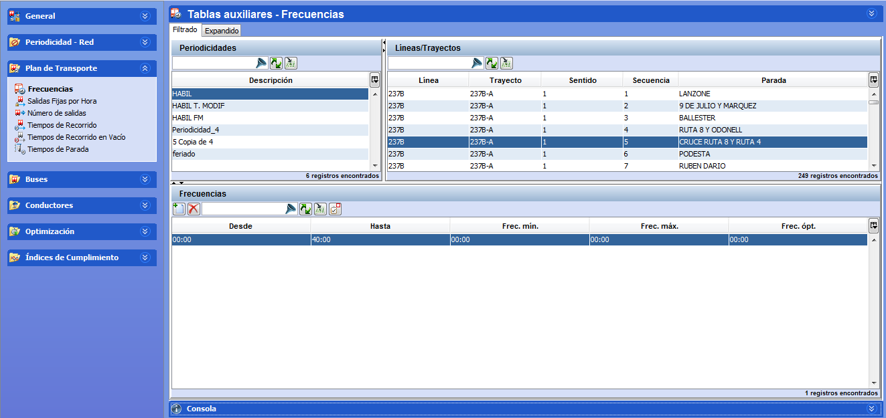
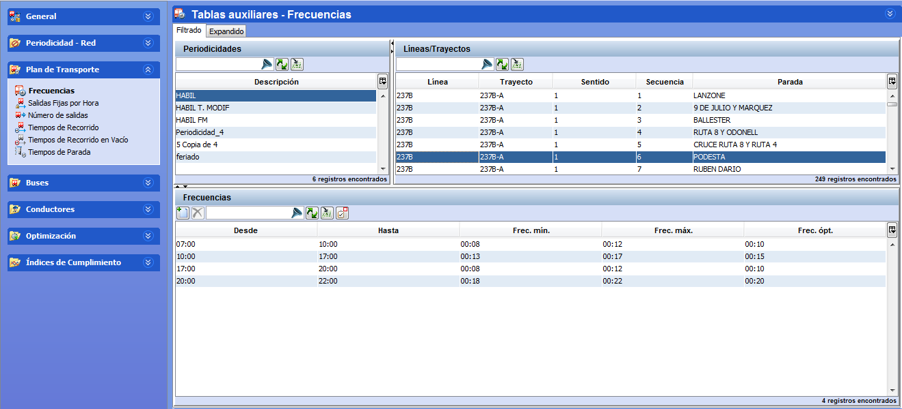

::: {#frecuencias .section .level3}
### Frecuencias

En la ventana Frecuencias de las tablas auxiliares, se pueden crear
tantas franjas horarias como tenga asociadas la línea/trayecto por
sentido/parada y para una periodicidad en particular. En esta ventana,
se muestran todas las líneas/trayectos definidas previamente en la
carpeta Red, así como las distintas periodicidades creadas.

[]{#_Toc465674499 .anchor}72 Frecuencias

Como puede verse en la ilustración más arriba, esta ventana dispone de
tres marcos. En los marcos Líneas/Trayectos y Periodicidad aparecen las
líneas-trayectos y las periodicidades creadas previamente. En el tercer
marco, Frecuencias, se define la frecuencia de paso deseada para cada
combinación Línea-trayecto-sentido-parada origen y periodicidad.

En el panel Frecuencias, para cada franja horaria asociada a una
línea/trayecto/parada por cada periodicidad, se indica la hora de inicio
y fin de la franja en las columnas Desde/Hasta, respectivamente. Además,
se define la oferta comercial mediante las frecuencias mínima, máxima
y/o óptima de inicio de paso por la parada seleccionada.

**Nota.** En la ventana Frecuencias es posible aplicar la selección
múltiple.

Los pasos a seguir para definir una frecuencia son:

1.  Seleccionar en el marco Líneas/Trayectos uno de los registros.

<!-- -->

1.  Seleccionar una periodicidad en el marco Periodicidad.

Los pasos siguientes deben hacerse para cada franja horaria necesaria:

1.  Hacer clic en el botón Crear del marco Frecuencias.

2.  Definir tantas franjas horarias como sea necesario indicando la hora
    de inicio (Desde) y de fin (Hasta) de cada franja y los datos de
    frecuencia óptima (Óptima), mínima (Mínima) y máxima (Máxima) en el
    formato adecuado (hh:mm).

Ejemplo

Para un trayecto se desea una frecuencia óptima de un tren cada 10
minutos desde las 7:00 hasta las 10:00, un tren cada 15 minutos desde
las 10:00 hasta las 17:00, un tren cada 10 minutos desde las 17:00 hasta
las 20:00 y un tren cada 20 minutos desde las 20:00 hasta las 22:00. Si
la oferta puede ser flexible y pueden sumarse o restarse 2 minutos en la
frecuencia minima y máxima, tendríamos 4 franjas horarias como en la
ilustración:

[]{#_Toc465674500 .anchor}73 Ejemplo de franjas horarias
:::
