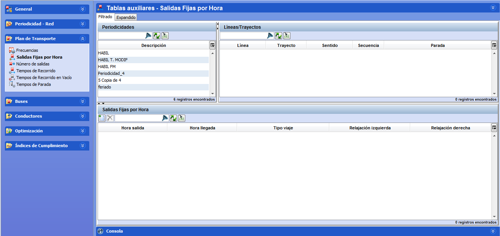

::: {#salidas-fijas-por-hora .section .level3}
### Salidas fijas por hora

En este apartado se introduce la oferta que se pretende dar en cada
trayecto para cada uno de los sentidos de la marcha, indicando el
horario exacto de cada expedición realizada.

La oferta viene dada por las salidas de autobuses por cada parada de
regulación del trayecto:

[]{#_Toc465674503 .anchor}76 Salidas fijas

En el marco, Salidas Fijas, se define la hora de salida deseada para
cada combinación Línea-trayecto-sentido-parada origen, fecha de validez
y periodicidad.

Los pasos a seguir para definir una salida fija son:

1.  Seleccionar en el marco Líneas-Trayectos uno de los registros.

<!-- -->

1.  Seleccionar una fecha de validez en el marco Fecha de validez.

2.  Seleccionar una periodicidad en el marco Periodicidad.

3.  Hacer clic en el botón Crear del marco Frecuencias.

4.  Definir tantas salidas fijas como sea necesario indicando la hora de
    salida (Hora de salida), tiempo de recorrido (Tiempo de recorrido),
    tiempo de parada (Tiempo de parada), tiempo de seguridad (Tiempo de
    seguridad), seleccionar el tipo de viaje (Tipo de viaje) e insertar
    el tipo de expedición (Tipo expedición).
:::
