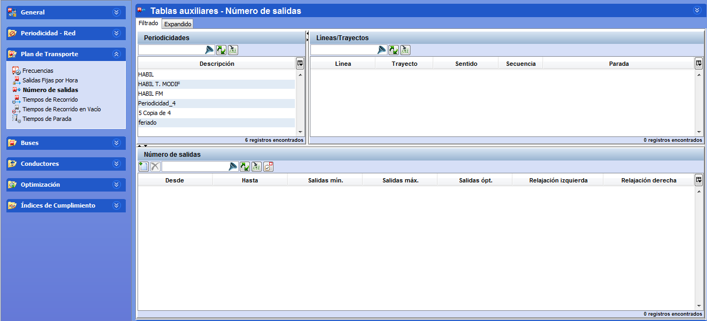

::: {#número-de-salidas .section .level3}
### Número de salidas

En esta carpeta pueden definirse el número de salidas por hora de
expediciones comerciales en una franja horaria para cada una de las
combinaciones línea-trayecto-parada:

[]{#_Toc465674504 .anchor}77 Ventana número de salidas

La ventana contiene los marcos Líneas/Trayectos y Periodicidad donde
aparecen las líneas-trayectos y las periodicidades creadas previamente.
En el tercer marco se introduce el número de salidas deseadas por franja
horaria correspondientes al trayecto y periodicidad seleccionados.

Los pasos a seguir para definir la oferta por número de salidas son:

1.  Seleccionar en el marco Líneas/Trayectos uno de los registros.

<!-- -->

1.  Seleccionar una periodicidad en el marco Periodicidad.

Los pasos siguientes deben hacerse para cada franja horaria necesaria:

1.  Hacer clic en el botón Crear del marco Número de salidas.

2.  Definir tantas franjas horarias como sea necesario indicando la hora
    de inicio (Desde) y de fin (Hasta) de cada franja, y el valor de
    salidas óptimas (Salidas opt.).
:::
