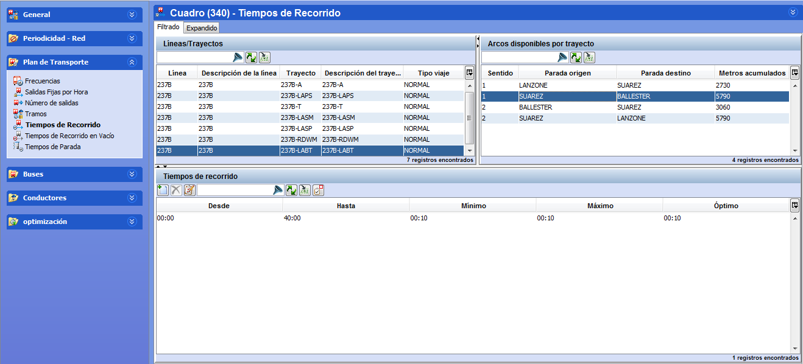

::: {#tiempos-de-recorrido-en-el-escenario .section .level4}
#### Tiempos de recorrido en el escenario

Al insertar una línea en un escenario, si existen tiempos de recorrido
para la periodicidad principal del escenario definida en la ventana
principal del escenario, se copiarán en el escenario (véase apartado
3.2.2 Modificar un escenario). Si no, los tiempos de recorrido estarán
vacíos y el usuario podrá rellenarlos de manera similar a las tablas
auxiliares.

Para copiar los datos de las tablas auxiliares, se puede utilizar el
botón Copiar tiempos de recorrido desde tablas auxiliares. Los datos que
se copian entonces corresponden a la periodicidad definida en la
pantalla principal de edición del escenario.

[]{#_Toc465674506 .anchor}79 Tiempos de recorrido en el escenario

Para insertar o modificar los tiempos de recorrido de un trayecto:

1.  Seleccionar el trayecto en el marco Líneas/Trayectos disponibles

<!-- -->

1.  Seleccionar el arco en el marco Arcos disponibles del trayecto

2.  Introducir los datos en el marco Tiempos de recorrido. Este proceso
    es idéntico al de la ventana correspondiente de las tablas
    auxiliares.

**Nota.** En la ventana Tiempos de recorrido, es posible aplicar la
selección múltiple.
:::
