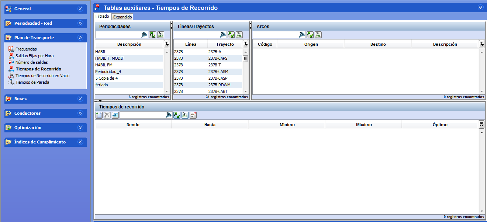

::: {#tiempos-de-recorrido .section .level3}
### Tiempos de recorrido

El tiempo de recorrido en expedición define el tiempo que tarda un
autobús en recorrer un arco con viajeros. Es necesario definir los
tiempos de recorrido en expedición para todos los arcos de cada trayecto
y en ambos sentidos.

A la hora de definir los tiempos de recorrido es preciso tener en cuenta
las circunstancias del tráfico a lo largo del día, el día de la semana,
el periodo del año, etc.

Por otra parte, los tiempos de recorrido en expedición deben cubrir como
mínimo todo el periodo de tiempo de oferta comercial, aunque en ningún
caso marcan el inicio de un servicio. De hecho, se recomienda extender
la definición de los tiempos de recorrido para toda la franja horaria
del día aunque no haya oferta comercial en determinados horarios.

Así, para establecer un tiempo de recorrido en expedición entre dos
paradas de un trayecto y sentido, se divide el periodo de tiempo en
tantas franjas horarias como variaciones haya en los tiempos de
recorrido.

Ejemplo

Si entre dos paradas se estima un tiempo de recorrido en expedición de
10 minutos desde las 7:00 hasta las 9:00, de 20 minutos entre las 9:00 y
las 16:00, de 10 minutos entre las 16:00 y las 19:00, y de 30 minutos
entre las 19:00 y las 24:00, se debe definir un tiempo de recorrido en
expedición dividido en cuatro franjas horarias (7:00-9:00, 9:00-16:00,
16:00-19:00 y 19:00-24:00) o (1:00-9:00,9:00-16:00,16:00-19:00 y
19:00-30:00) y dentro de cada una definir los tiempos deseados.

[]{#_Toc465674505 .anchor}78 Tiempos de recorrido

La ilustración más arriba muestra la ventana Tiempos de recorrido que
está dividida en tres marcos, todos ellos necesarios ya que para crear
los tiempos de recorrido es preciso saber a qué arco se le asigna dicho
tiempo de recorrido, a partir de qué fecha entran en vigor esos tiempos
y a que periodicidad están asociados.

Los pasos para definir el tiempo o tiempos de recorrido de un arco son:

1.  Seleccionar un arco en el marco Arcos con el selector
    correspondiente.

-   Seleccionar una periodicidad en la pestaña Periodicidades.

Los pasos siguientes deben efectuarse para cada franja horaria
necesaria:

1.  En el marco Tiempos de recorrido, hacer clic en el botón Crear.

-   Introducir la hora de inicio (Desde) y de fin (Hasta) de la franja
    > horaria.

-   Insertar los tiempos de recorrido mínimo (Mínimo), máximo (Máximo) y
    > óptimo (Optimo) de la franja horaria. El formato de estos datos es
    > hh:mm.

Para eliminar una franja horaria, hay que hacer clic en el botón Borrar.

**Nota.** Esta ventana dispone de la herramienta de filtrado. En el
marco Tiempos de recorrido es aplicable la selección múltiple.
:::
