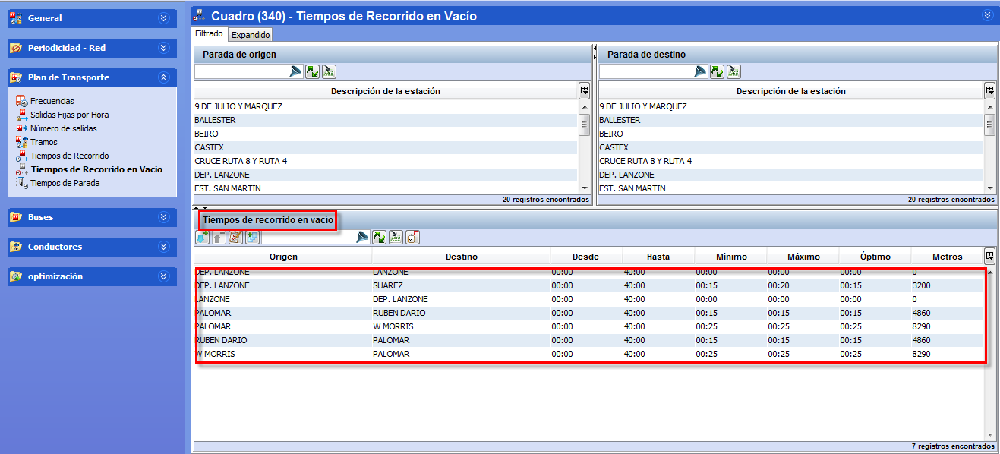

::: {#tiempos-de-recorrido-en-vacío-en-el-escenario .section .level4}
#### Tiempos de recorrido en vacío en el escenario

Al insertar una línea en un escenario, si existen tiempos de recorrido
en vacío para la periodicidad seleccionada del escenario definida en la
ventana principal del escenario, se copiarán en el escenario (véase
apartado 3.2.2 Modificar un escenario).

[]{#_Toc465674509 .anchor}82 Modificar tiempos de recorrido en vacío en
el escenario
:::
