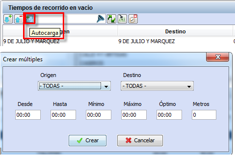

::: {#tiempos-de-recorrido-en-vacío .section .level3}
### Tiempos de recorrido en vacío

Los tiempos de recorrido en vacío definen el tiempo que se tarda en
realizar una expedición en vacío, es decir, sin viajeros. Por supuesto,
entre las dos paradas debe estar permitida la conexión.

A la hora de definir los tiempos de recorrido es preciso tener en cuenta
las circunstancias del tráfico a lo largo del día, el día de la semana,
el periodo del año, etc.

Así, para establecer un tiempo de recorrido en vacío entre dos paradas,
se divide el periodo de tiempo en tantas franjas horarias como
variaciones haya en los tiempos de recorrido.

Ejemplo

Si entre dos paradas se estima un tiempo de recorrido en vacío de 10
minutos desde las 7:00 hasta las 9:00, de 20 minutos entre las 9:00 y
las 16:00, de 10 minutos entre las 16:00 y las 19:00, y de 30 minutos
entre las 19:00 y las 24:00, se debe definir un tiempo de recorrido en
expedición dividido en cuatro franjas horarias (7:00-9:00, 9:00-16:00,
16:00-19:00 y 19:00-24:00) o (1:00-9:00,9:00-16:00,16:00-19:00 y
19:00-30:00) y dentro de cada una definir los tiempos deseados.

[]{#_Toc465674507 .anchor}80 Tiempos de recorrido en vacío

Los pasos siguientes deben efectuarse para cada franja horaria
necesaria:

1.  En el marco Tiempos de recorrido en vacío, hacer clic en el botón
    Crear.

<!-- -->

1.  Seleccionar una periodicidad en la celda Periodicidades.

2.  Seleccionar en los combos la parada origen y la parada destino.

3.  Introducir la hora de inicio (Desde) y de fin (Hasta) de la franja
    horaria.

4.  Insertar los tiempos de recorrido mínimo (Mínimo), máximo (Máximo) y
    óptimo (Optimo) de la franja horaria. El formato de estos datos es
    hh:mm

5.  Introducir la distancia en metros entre las dos paradas
    seleccionadas como parada origen y parada fin.

Para eliminar una franja horaria, hay que hacer clic en el botón Borrar,
recordar que esta ventana tiene selección múltiple, de tal forma que se
pueden eliminar varios registros a la vez, seleccionándolos en la tabla
y pulsando el botón Borrar.

**Nota.** Esta ventana dispone de la herramienta de filtrado.

Además, en el marco Tiempos de recorrido en vacío es posible crear de
forma simultánea múltiples tiempos de recorrido en vacío. Para activar
esta opción hay que hacer clic en Crear múltiples.

[]{#_Toc465674508 .anchor}81 Crear múltiples

1.  Seleccionar en los combos la parada origen y la parada destino.

<!-- -->

1.  Seleccionar una periodicidad en el despegable Periodicidades.

2.  Introducir la hora de inicio (Desde) y de fin (Hasta) de la franja
    horaria.

3.  Insertar los tiempos de recorrido mínimo (Mínimo), máximo (Máximo) y
    óptimo (Optimo) de la franja horaria. El formato de estos datos es
    hh:mm.

4.  Distancia en metros entre las dos paradas seleccionadas.

**Nota.** La opción de Crear múltiples es muy útil para crear los
tiempos de recorrido en vacío entre una parada y todos sus depósitos o
entre todos los depósitos y una parada seleccionada.
:::
