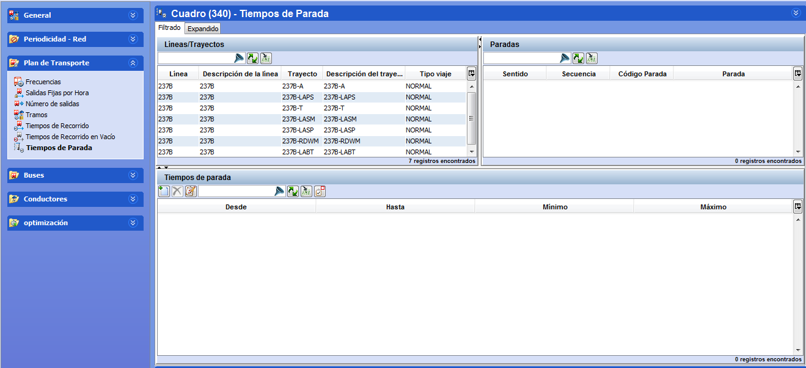

::: {#tiempos-de-parada .section .level3}
### Tiempos de parada

En esta carpeta se define el tiempo de parada de un autobús en las
paradas de un trayecto. Los tiempos de parada se introducen por franjas
horarias.

[]{#_Toc465674510 .anchor}83 Tiempos de parada

Para introducir los tiempos de parada:

1.  Seleccionar la línea-trayecto en el marco Líneas/Trayectos.

<!-- -->

1.  Seleccionar la parada en el marco Paradas.

2.  Crear de forma secuencial todas las franjas horarias con el botón
    Crear del marco Tiempos de parada rellenando para cada una los
    campos Desde, Hasta, Mínimo y Máximo.

Es posible definir tiempos de parada mínimos y máximos en Paradas,
incluso para aquellos puntos que no sean de regularización. El cálculo
tendrá en cuenta estos tiempos en el cálculo de soluciones, de modo que
un autobús se detendrá en la parada un tiempo comprendido entre el valor
mínimo y el valor máximo especificados.

**Nota.** Las herramientas de filtrado y de búsqueda están disponibles
en esta ventana.
:::
