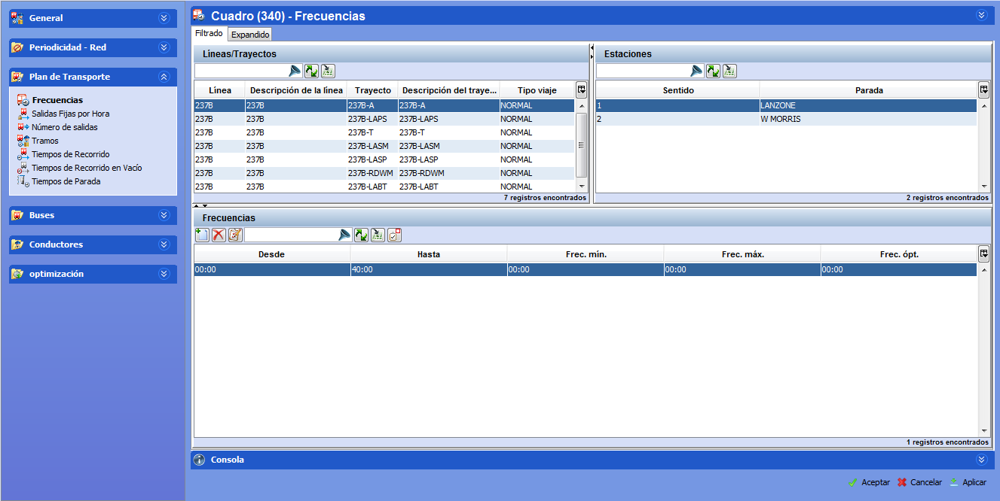

::: {#plan-de-transporte .section .level2}
Plan de transporte
------------------

El plan de transporte es uno de los datos de entrada de la herramienta,
que se calcula teniendo en cuenta los datos que proporciona el cliente
para definir su modelo. Entre los elementos que se definen en el plan de
transporte se encuentran las frecuencias por líneas/trayectos/paradas y
los tiempos de recorrido.

GoalBus® es capaz de representar cualquier tipo de oferta que tenga una
línea o trayecto. Se pueden definir modelos de ofertas planas, con picos
solo por la mañana, solo por la tarde, o en ambas franjas horarias,
ofertas solo de medio día, etc. También es posible definir ofertas
simétricas en ambos sentidos de circulación o bien ofertas asimétricas,
etc. Recordar que la oferta o plan de transporte define el servicio que
se pretende dar en cada línea/trayecto, para cada uno de los dos
sentidos de la marcha, y para todos los trayectos incluidos en el
escenario.

[]{#_Toc465674498 .anchor}71 Plan de transporte

En la carpeta Plan de transporte se definen las frecuencias, los tiempos
de recorrido en trayectos comerciales, los tiempos de recorrido en
vacío, los tiempos de parada y los costes de viajes en vacío. Los
valores almacenados en tablas auxiliares son los que aplican por defecto
a todos los escenarios. Estos datos podrán definirse y modificarse en el
propio escenario, teniendo en cuenta las características específicas del
mismo.

Para acceder a la información de la oferta/frecuencia que aplica sólo al
escenario seleccionado, hacer clic con el ratón sobre el botón Modificar
(F7) .

En las siguientes secciones, se describen con detalle los elementos
básicos para definir el plan de transponte, tanto en tablas auxiliares
como en el escenario.
:::
