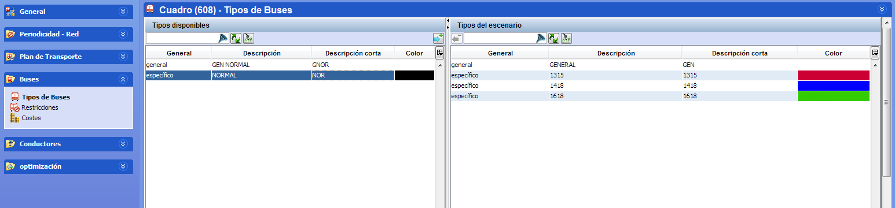

::: {#activar-tipos-de-autobús-en-el-escenario .section .level4}
#### Activar tipos de autobús en el escenario

La ventana Tipos de buses en un escenario permite activar los tipos de
autobús que se permite utilizar en el cálculo, eligiendo de entre los
existentes definidos en tablas auxiliares.

La ventana contiene los siguientes paneles:

-   Tipos disponibles: muestra los tipos de autobús definidos en tablas
    > auxiliares. Se muestran los tipos generales y los específicos en
    > la misma tabla.

-   Tipos del escenario: muestra los tipos de autobús activados para
    > utilizar en el cuadro.

[]{#_Toc465674513 .anchor}86 Tipos de autobús activos en un cuadro

Los pasos para activar los autobuses que se desean utilizar en el
cálculo son los siguientes:

1.  En el panel Tipos disponibles, seleccionar los tipos de autobús que
    se quieren utilizar en el cálculo. En esta ventana es posible
    seleccionar a la vez tipos de autobús generales y específicos.

<!-- -->

1.  Pulsar el botón Aceptar para incluir en el cuadro una copia de los
    tipos de autobús seleccionados.

**Nota.** En un escenario solo se puede usar un tipo de autobús general,
ya que sus reglas se aplican a todos los autobuses del escenario, pero
se pueden definir varios tipos de autobús generales para usarlos en
escenarios alternativos.

Sí se pueden incluir varios tipos de autobús específicos en un mismo
escenario, para indicar los diferentes tipos de vehículos utilizados.

Los tipos añadidos al cuadro inicialmente utilizan los parámetros que
tienen definidos en tablas auxiliares. Es posible modificar los
parámetros que se utilizarán en el cálculo cambiándolos en las ventanas
Restricciones y Costes de autobús en el cuadro, sin que se modifique la
definición guardada en tablas auxiliares.

Para desactivar la utilización de un tipo de autobús en el escenario,
seleccionarlo en el panel Tipos del escenario y pulsar el botón
Suprimir.
:::
