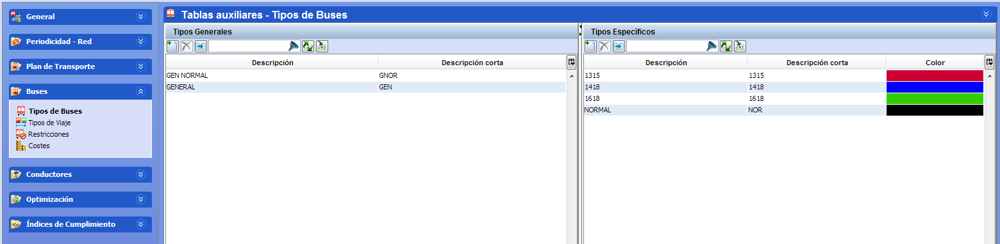

::: {#tipos-de-buses .section .level3}
### Tipos de buses

En esta carpeta se definen las diferentes plantillas de reglas que
afectan directamente a los vehículos. Se permite crear plantillas de
reglas generales y específicas, en las que se almacenan las
características físicas de los vehículos, la definición de restricciones
y la definición de los costes asociados a las restricciones.

Diferenciamos dos tipos de plantillas de reglas para los autobuses: Tipo
general y Tipo específico:

-   Tipo general: Las restricciones que aplican a tipos generales son
    > una selección de limitaciones de vehículo que afectan
    > conjuntamente a varios tipos de autobús en el cálculo de la
    > solución (número máximo de cambios de línea por autobuses, los
    > autobuses deben o no finalizar en la estación de inicio, etc.)

-   Tipo específico: Las restricciones que aplican a tipos específicos
    > de autobuses permiten identificar diferentes propiedades o
    > limitaciones propias del tipo de autobús físico. Entre otras
    > posibilidades, nos permite definir el tamaño de los autobuses,
    > capacidad, y tiempos de repostaje asociados al tipo de autobús.

[]{#_Toc465674511 .anchor}84 Tipos de Buses

La ventana Tipos de Buses se divide en dos paneles: Tipos Generales y
Tipos Específicos, donde definiremos cada uno de los tipos de plantilla
considerados. En cada una de las secciones de la ventana, el usuario
podrá crear tantos tipos de servicio de autobús generales y específicos
como desee.

1.  Pulsar sobre el botón Crear un nuevo registro.
    

<!-- -->

1.  Introducir la descripción del nuevo tipo de autobús

2.  Pulsar el botón Aceptar para grabar los cambios.

Es posible borrar uno o varios tipos de autobús seleccionados, pulsando
el botón Suprimir.
:::
