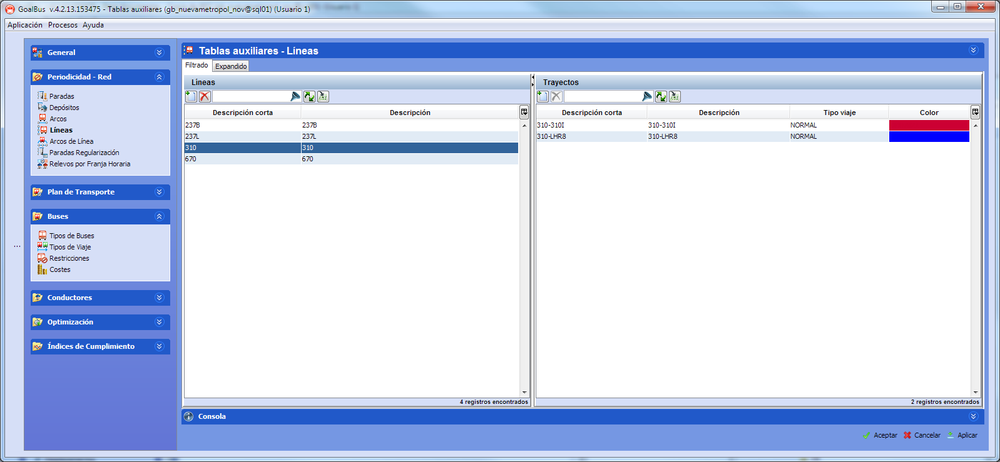

::: {#asociación-de-líneas-y-trayectos-a-tipos-de-viaje .section .level4}
#### Asociación de líneas y trayectos a tipos de viaje

En la ventana de Líneas en Tablas auxiliares, el panel Trayectos permite
elegir el tipo de viaje asociado a cada trayecto de los que componen la
línea.

El efecto de esta selección en el cálculo consiste en limitar los
autobuses que pueden circular por el trayecto. Sólo los autobuses
incluidos en el tipo de viaje seleccionado pueden realizar viajes
comerciales en ese trayecto.

[]{#_Toc465674515 .anchor}88 Tipo viaje asociado a un trayecto
:::
