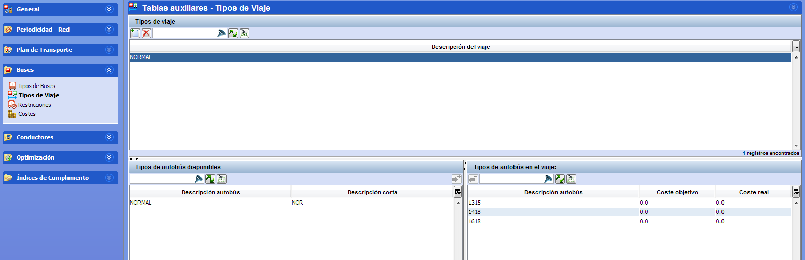

::: {#tipos-de-viaje-asociados-a-trayectos .section .level3}
### Tipos de viaje asociados a trayectos

Con los tipos de autobús se pueden crear grupos de tipos de autobús con
el objetivo de asociarlos a trayectos comerciales. Cada tipo de viaje
representa un grupo que incluye los tipos de vehículo a los que se
permite circular en un trayecto de la red de transporte.

Estos grupos se definen en la ventana Tipos de viaje. Posteriormente,
los tipos de viaje se asocian a los trayectos en la ventana Líneas de
las Tablas auxiliares.

Un tipo de viaje permite agrupar distintos tipos de autobús con
características comunes que pueden realizar un tipo de oferta. El tipo
de viaje permite asociar estos tipos de viaje a determinado trayecto
comercial, de forma que el trayecto será realizado por los tipos de
autobús incluidos.

[]{#_Toc465674514 .anchor}87 Tipos de viaje
:::
